title: Recap
# Recap

!!! tip "Info"
    This section Talks about The events that happened from 2023-2024 revolving around The AD campaign

!!! note "Thanks to"
    Thanks to vandercool8 for writing The original Document which can be found [here](https://docs.google.com/document/d/10HVwkYTKfYe0x_GX_fNzoFiKQgzeIfFVZTLRQHGi7-M/edit#heading=h.269wlzxtu7dd)!

## Known Videos

- [GET READY..!](https://www.youtube.com/watch?v=ygO3CDuD1Y4) by Adam Butcher
- [WHERE ARE THEY...? (Catastrophe Crow Toy Advert)](https://www.youtube.com/watch?v=XRJqSwTK1wI) by OPUS LEGACY 
- [WHERE ARE THEY...? (Catastrophe Crow Toy Advert)](https://www.youtube.com/watch?v=5zUTiKpgbtI) by Adam Butcher
- [ CATASTROPHE CROW! PLUSH – available now! ](https://www.youtube.com/watch?v=rr4-mMvS2K0) by Adam Butcher
- [ CATASTROPHE CROW! PLUSH – available now! ](https://www.youtube.com/watch?v=yJxcKqbJeZQ) by OPUS LEGACY
- [ Catastrophe Crow – Huggable, squishable! ](https://www.youtube.com/watch?v=acVgbhKTrLo) by OPUS LEGACY
- [ Catastrophe Crow – Huggable, squishable! ](https://www.youtube.com/watch?v=MeAq37F-7sU). by Adam Butcher
- ["FINAL DAYS!" (official catastrophe crow advert)](https://www.youtube.com/watch?v=m99M8LyuP4I) by Adam Butcher
- ["FINAL DAYS!" (official catastrophe crow advert)](https://www.youtube.com/watch?v=Zl7ndZPZ_Ng) by OPUS LEGACY

## Opus Letter
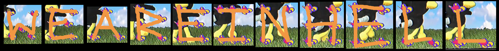{width="100}

On August 16th, 2023, Adam Butcher uploaded a tweet and a community post on his YouTube with an opus letter.
Quote:
    “Got this letter today (!). Surprised Opus exists in any shape or form tbh, but they seem to have some future plans… Watch this space!
    #CatastropheCrow"

On the note it thanks Adam for bringing Opus’s title Catastrophe Crow! to a wider audience via his youtube channel. It seems like Opus is aware of Adam’s documentary video, as proven by the letter.

!!! danger " "
    It’s unknown if the letter actually spells anything or if it’s just lorem ipsum, although below Adam’s hand you can see a word that spells out “provide”.

**It’s interesting to note that the youtube post and the twitter one differ, on youtube one instead of “Watch this space!” it’s “Will keep you posted!”.**

## GET READY..!

September 7th, 2023, Adam Butcher uploaded a [video](https://www.youtube.com/watch?v=ygO3CDuD1Y4) on his channel called “GET READY…!”. The video features a distorted main theme of Crow 64, with what seems to be Mr. Crow spinning to face the viewer. 

!!! tip "Description"
    “It’s more than just a toy, it’s the beginning of an adventure!”
    Video credit: Opus Legacy Co.

If you paid close attention to the left part of the screen, you could see some weird pixel column pattern. Extracting the image you get this:

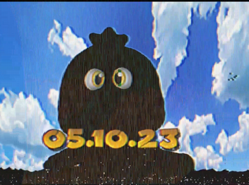{width="100}

The date says **05.10.23**

!!! warning " "
    This is presumably the date The ARG returns, or seeing Crow 64 plushie [here](https://www.makeship.com/products/catastrophe-crow) that starts funding on the same date.. (The Plush has been funded As of November 3rd, 2023.)

It’s official, because it was created back in July of 2023. You can also find Opus Legacy on [Twitter](https://twitter.com/OpusLegacy).

They have uploaded the exact same video on their channel. It is unknown what they’re trying to tell us, but they do follow Ulrich Aderman, Ultra 64 Forever and Adam Butcher on twitter, so it’s possible that they are other former employees

!!! warning " "
    Very interesting to note it’s not Opus Interactive as how it used to be, it’s now called Opus Legacy for some reason. It’s possible Opus is trying to make some kind of comeback or something else, but there is no clear evidence or clues as to why, how, and who.

## WHERE ARE THEY...?

September 21st, 2023, Opus Legacy uploads a video on their channel called “WHERE ARE THEY…? (Catastrophe Crow Toy Advert)”, a minute after, the video also lands on Adam Butcher’s channel.

The video promotes a new Makeship [plushie](https://www.makeship.com/products/catastrophe-crow) featuring Mr. Crow. The date 05.10.23 is when the funding launches, and production starts on October 27th, 2023. Estimated shipment date is January 20, 2024.

Both the Opus Legacy and Adam Butcher videos are different. Click [here](https://viewsync.net/watch?v=XRJqSwTK1wI&t=0&v=5zUTiKpgbtI&t=0&mode=solo) to see both videos played at the same time.

### Differences

#### Cartridge

 At 0:05 the cartridge zooms in.

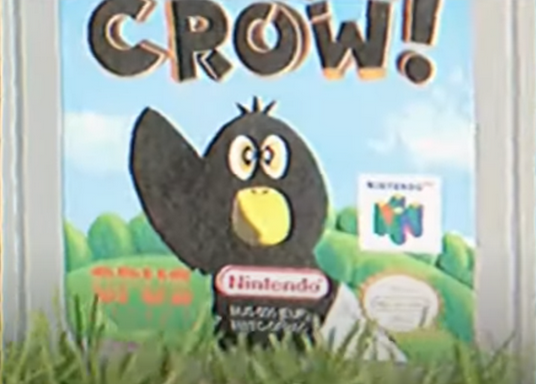{width="100}

!!! note " "
    Important to note that the serial number on the cartridge is very different from Nintendo ones. The part below seems to spell NWTC-OPHAC, which from Crow Language translates to “CANT-EXIST”. 

#### Jigsaw First Appearance

At 0:06 you can see a weird code, similar to one seen in WHAT HAPPENED TO CROW 64? when Adam launches the game.

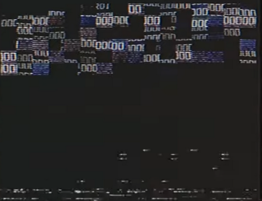{width="100}

#### Work building Windows

At 0:07, for a brief moment (few frames), right after the jigsaw puzzle, you can see that some of the work building windows are blacked out.

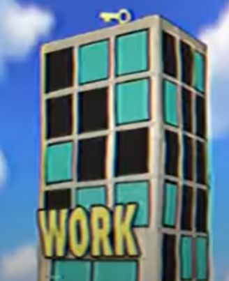{width="100}

**It’s important to consider that blacked out windows have already been used for solving one of the puzzles in ARG. This is very similar.**

Members of the community were able to put out numbers from the blacked out windows: 
```38, 51, 31, 35, 4 or 385131354 (put together).```

!!! note " "
    This will be used to solve The BASE64 Puzzle later!

## Makeship

Makeship is a company that makes marketable plushies. On the official [link](https://www.makeship.com/products/catastrophe-crow) to the Crow plushie

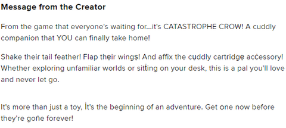{width="100}

Look Closely, Some of the letters are not what they seem

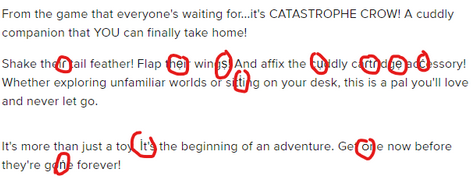{width="100}

they spell out “resurrection” or taken from the website “ɾẹṣụɾɾẹċṫİᴑṅ”. 

!!! warning " " 
    This will be later useful to unlock the Itch.io Page for The Catastrophe Crow game.

On October 5th, The makeship plushie finally got revealed and funding started.

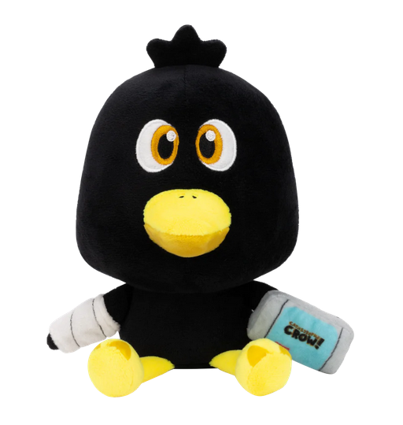{width="100}

## CATASTROPHE CROW! PLUSH - Available now!

On October 5th, 2023, two new videos got posted again. [One](https://www.youtube.com/watch?v=rr4-mMvS2K0) by Adam and [one](https://www.youtube.com/watch?v=yJxcKqbJeZQ) by Opus. They are almost identical, and the Opus one only has one difference.

We’ve got some new looks at the Catastrophe Crow plushie. This is probably just an advertisement to advertise the plushie.

### Resurrection is back

Around 0:06 an odd sound appears. Reversing it you can hear the word “Resurrection” being spoken. Click [here](https://cdn.discordapp.com/attachments/766502962276466718/1159573217904701450/resurrection.mp3?ex=653183b6&is=651f0eb6&hm=d404d4c208a538350e8812b04ea3bc0b51c92fbf2e71ef5dd5f59e71343b89a5&) to download and listen.

### Coins UI and Controller Pattern Puzzle

Starting from 0:07 the controller appears on the screen. Looking in the right bottom corner you can see the coins ui. This current frame says 00.
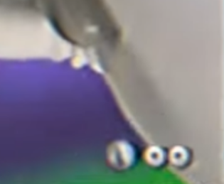{width="100}

Around a second later, an almost identical thing appears, but now with 01 in there.

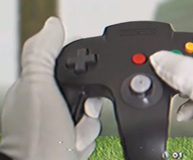{width="100}

Another second later, we can now see this.

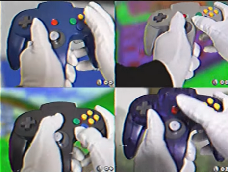{width="100}

Here are all the numbers listed here, in order of appearance:

    00 00 01 06 00 02 04 00 01 00 06 05 02 03


Now come the controllers. There seems to be a pattern in the way the buttons are pressed, too:

- First Frame: A
- Second Frame: R-button
- Third Frame: D-pad
- Top Left: START + A + D-pad
- Top Right: Control Stick (Circular Motion) + START + D-pad
- Bottom Right: START + C-button + D-pad
- Bottom Left: START + B

The chronological order of buttons pressed is as follows:

    A-button → R-button → D-pad → START → Control Stick (Circular Motion) → START → START → A-button → START → C-button → B-button → D-pad → L-button → D-pad

Let’s use the method used in [“Controller cipher / Crow Language #6”](/main/#controller-cipher-crow-language-6) in the entire Crow64 Known Info document in order to translate these buttons into letters.

- Analog stick ➡ Follow the motions, they draw a letter
- D-pad ➡ D
- Start button ➡ S
- A/B buttons ➡ A/B
- Analog C buttons ➡ C
- Left shoulder button ➡ L
- Right shoulder button ➡ R

The sequence of letters is as follows: ```A R D S O S S A S C B D L D```

The coin count is used to move letters forward by their assigned number.

!!! tip " "
    E.G: Let's take the number 1 and letter X, this means you have to move X by one in alphabetical order, thus making it Y. 

Now, let's take the coin count and connect them with the letters. There are enough numbers for each letter. 

| Letters       | Numbers                              |
| :---------- | :----------------------------------- |
| `A`        | 0  |
| `R`       | 0 |
| `D`    | 1 |
| `S`    | 6 |
| `O`    | 0 |
| `S`    | 2 |
| `S`    | 4 |
| `A`    | 0 |
| `S`    | 1 |
| `C`    | 0 |
| `B`    | 6 |
| `D`    | 5 |
| `L`    | 2 |
| `D`    | 3 |

The end result becomes:
```AREYOUWATCHING```

### New gameplay

Around 0:18-0:20, new gameplay can be seen. Mr. Crow is walking into a tunnel next to the computer. This is a level from the video [Catastrophe Crow! – Underground Level](https://youtu.be/UF5THpGez-w). This tunnel never appears in the unity project, or even in any of the videos. 

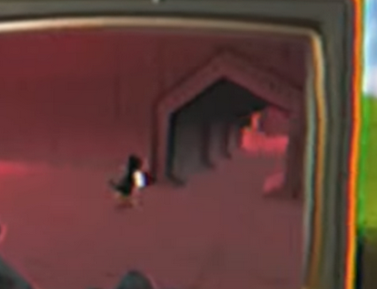{width="100}

### Differences

#### Jigsaw Second Appearance

Unlike in previous videos from Opus Legacy’s version, a lot was changed. In this video’s case though, there's only one major difference, and that is the second half of the Jigsaw puzzle.

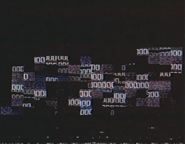{width="100}

The Unscattered image:
{width="400"}

On The Top it Says **BWCROI** which translates to FATHER from Crow language

Going Top to bottom, there is:
```
11
38
19
11
17
15
23
24
21
22
14
13
18
21
13
```
**Letters per line*

It’s worth noting that we have SOME words to work along with, that were deciphered over the course of each video being released, those being:

- RESURRECTION - 12 letters
- WEAREINHELL - 11 letters
- AREYOUWATCHING - 14 letters


## Return of Ulrich Aderman

On October 8th, the [Twitter](https://twitter.com/AdermanUlrich) account of Ulrich Aderman retweeted the second Opus Legacy Co. plush ad that contained editing differences compared to the original YouTube advertisement. 

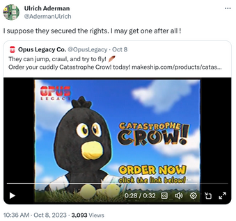{width="400"}

*“I suppose they secured the rights. I may get one after all!”*

!!! tip " "
    It has been confirmed through a reply to ParadoxFactor that Ulrich doesn’t know who bought the rights to Opus, nor is he connected to anyone involved in the company’s comeback. It is worth noting in his reply to Miles that he is retired. He spends most of his time with his family and dogs.

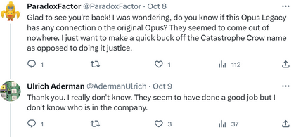{width="400"}

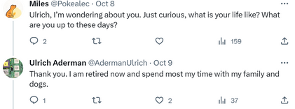{width="400"}

These replies are possible confirmation that Ulrich Aderman is not a sockpuppet account of Manfred’s, as previously theorized.

## Catastrophe Crow - Huggable, squishable!

On October 12th, 2023, we got another new video. As always, one by [Opus](https://www.youtube.com/watch?v=acVgbhKTrLo) and [Adam](https://www.youtube.com/watch?v=MeAq37F-7sU). The differences aren’t major again, everything is partially the same. Though there is some interesting things in both of them.

### Butterfly Pattern

From 0:05 to 0:07, butterflies can be seen flying. They are shaped in a form of a letter, and there are 11 frames with butterflies, so 11 letters.

{width="700"}

### Spying eye

At 0:08 Mr. Crow is about to enter the WORK building. At the last remaining frames an eye can be seen looking out.

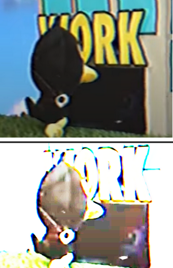{width="200"}

### New gameplay #2

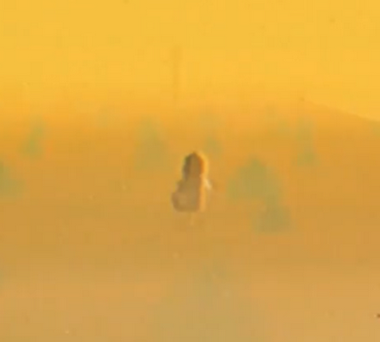{width="200"}

This looks like a desert level, with a weird figure that Mr.Crow is Approaching

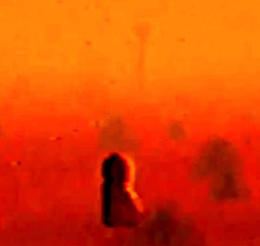{width="200"}

This is likely The [Scarecrow](/main/#creatures), since The head fits The money bag form, and is also t-posing.

### Jigsaw Third Appearance — OPUS LEGACY

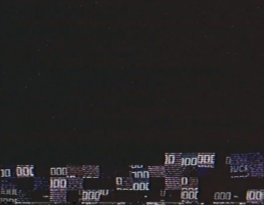{width="200"}

### Manfred is back — Adam Butcher

At 0:16 plushie version of Manfred is seen standing in what appears to be an attic.

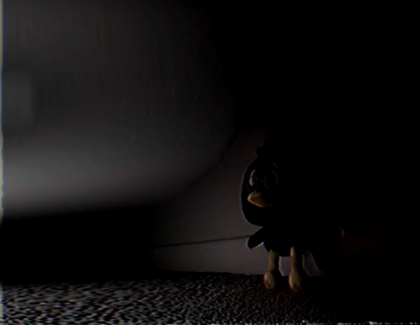{width="300"}

!!! note " "
    It’s worth noting that Manfred’s plushie doesn’t have a bandage, unlike the original Crow does, suggesting that someone had to manually remove the bandage off of the plush.

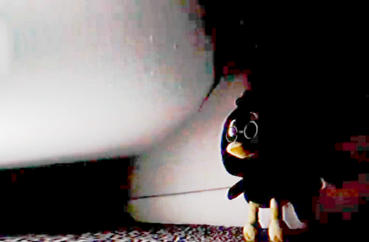{width="300"} *Brightned up*

## "FINAL DAYS!" (official catastrophe crow advert)
 
 On October 19th, 2023, [Adam Butcher](https://www.youtube.com/watch?v=m99M8LyuP4I) and [Opus](https://www.youtube.com/watch?v=Zl7ndZPZ_Ng) uploaded another advert to promote the plush. For the first time both versions are IDENTICAL and there is not any differences in it spotted at ALL.

 ### Odd forest

Some shots of an odd forest appear in the video. It’s unknown if it means anything.

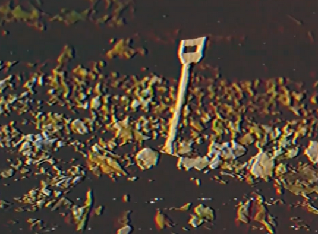{width="300"}

### Controller pak

At 0:34 we are shown what appears to be a controller pak of Crow 64. Purpose is unknown. Might be indicating the release of the playable build for CC64.

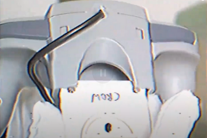{width="300"}

### Crawler

Right before the Base64 image appears, there are weird pixels seen all in a random order. A few frames later, a scattered image of Base64 also appears, which actually is a hint that we need to place them all in place again. This is technically a jigsaw puzzle #2.

<div class="video-wrapper">
  <iframe width="480" height="320" src="https://www.youtube.com/embed/T9fHVPXR064" frameborder="0" allowfullscreen></iframe>
</div>

What appears to be Crawler from CC64 crawling up to the camera. Crawler always represents Nils in the original run, so take that in mind.

### Base64 Image 

For a few frames, a weird shot of what appears to be an image encoded into Base 64.

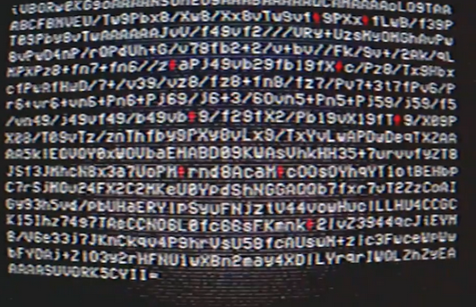{width="500"}

There are a lot of weird red looking things. These are ankh images we got from the previous arg run. In the subtitles of the TikTok video and YouTube video on the Opus Legacy pages, the ankhs are represented by @ signs. There are 9 ankhs in the images, and there are also 9 numbers found from the [new building](#work-building-windows) binary puzzle. Thus, inserting each of building numbers into the ankhs in order results in:

```
iVBORw0KGgoAAAANSUhEUgAAABAAAAAQCAMAAAAoLQ9TAAABCFBMVEU/Tw9Pbx8/Xw8/Xx8vTw9vf39PXx8fLwB/f39PT09Pby8vTwAAAAAAJvV/f49vf2///VRy+UzsMyOMGhAvPw8vPwD4nP/rQPdUh+G/v79fb2+2/v+bv//Fk/9v+/2Ak/qLMPXPz8+fn7+fn6//z5aPj49vb29fb19fX1c/Pz8/Tx9HbxcfPwAfHwD/7+/v39/vz8/fz8+fn8/fz7/Pv7+3t7fPv6/Pr6+vr6+vn6+Pn6+Pj69/j6+3/6Ovn5+Pn5+Pj59/j59/f5/vn49/j49vf49/b49vb39/f29fX2/Pb19vX19fT19/X09PX08/T09vTz/znThfby9PXy8vLx9/TxYvLwAPDwDeqTXZAAAA5klEQVQY0xWOVbaEMABD09KWAsVhkHH35+7urvvfyZT8JSf3JMhcN8x3a7UoPM3rnd8AcaM5cOOsOYhqYT1otBEHbpC7rSjMOu24FX2C2MKeU0YpdShNGGAQQb7fxr7vT2ZzCoAIGy93h5vd/pbUHaERYlpSyuFNjztV44vowHuclLLHU4CCGCK15Ihz74g7TAeCCNO6L0fc66sFKmnk42lvZ3944qcJiEYM8/V6e33j7JKnCkqv4P9hrVsU58fcAUswM+zlc3FwceWpWwbFYDAj+ZlO3y2rHFNU1wXBn2may4XDlLYrqrIWQLZhZyEAAAAASUVORK5CYII=
```

**Up-Scaled:**

{width="200"}

The background of this image has weird colors. If we refer back to WHERE ARE THEY? advert, the colors match those seen in that video.

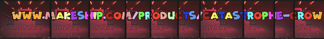{width="200"}

Which uncovers an Itch.io page

## Catastrophe Crow! Official Game on itch.io

Using the Base64 image and colors that matched to letters in the WHERE ARE THEY? video, we were able to find a link to the [official CATASTROPHE CROW! game on itch.io](https://opuslegacy.itch.io/play-catastrophe-crow). It was password locked with The password being ***RESURRECTION***

## Release date

In the old [05.10.23](#get-ready) image, weird dots are seen.

If you take the row of each pixel treading the bottom row as zero and counting upwards, they decode to 051023, the same release date shown on the image, 05/10/23 (October 5, 2023).

Oddly enough, these dots are also seen in the newest base 64 image. 
If you do the same thing with the new cartridge image you get 260424, or 26/04/24 (April 26, 2024).

!!! note " "
    This is presumably the official release date of the Catastrophe Crow! game.

## The plushie is – funded!
On October 23-24th, 2023, the plush finally gets funded (reaches 200 sold), which means everyone is getting their own plush now!

## — A final message from Opus Legacy Co.
On November 3rd, 2023, a new video was uploaded both to AdamButcher’s and Opus Legacy’s channel. 

### Teddy bear toy returns

From timestamp 0:00 to 0:05, and 0:07, a teddy bear plushie can be seen transforming into the Mr. Crow

{width="200"}

### Wind-up key puzzle (Keyboard puzzle)

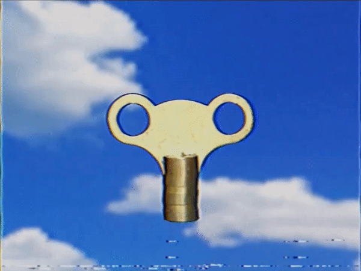{width="200"}


Opus Legacy’s video has the same clip, but the noise is different. The noises in the background are the keyboard noises that were seen in [Catastrophe Crow! – Underground Level video](https://youtu.be/UF5THpGez-w).

Turning the noise from the audio into letters, we get a phrase:

**I W A I T E D**


### High-res look at the Base64 cartridge

In Opus Legacy’s video version, around from 0:13 to 0:14, a cartridge image faintly appears.
 It’s the same cartridge image we got from the Base64 image puzzle, but high resolution. 
 
 *It’s unknown if there’s any emphasis on it.*

 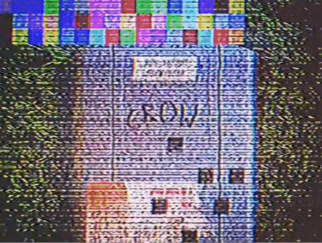{width="200"}

 ## Conclusion

So concludes the Recap for now. There are a lot of things to find, decipher, and wait for. I suggest you keep an eye out and join the [discord server](https://discord.gg/9hcZQjBSQn) which is where a lot of stuff is being found through. I recommend you to check the [puzzle doc](https://docs.google.com/spreadsheets/d/1Yahw1AabsLlxbjIZLSOVtDTY8rVXXHI6xe-fWI6LKmw/view) to keep up with what has been deciphered and whatnot.


## Credits

### Document Editors
- vandercool8
- Lamechial

### People who helped research

- Paradox Factor - First one to find out about work building windows numbers (also them going into the missing ankhs), figuring out the hidden message in the "FINAL DAYS" audio
- wintyr - Extracting “resurrection” from the Makeship website, for being the first person to write the Base64 code and work on multiple revisions
- Mr. Chair -  Extracting the date from GET READY…!, actively working on solving the jigsaw puzzle, extracted the numbers from controllers from CATASTROPHE CROW! PLUSH - Available Now!
- Miles - Extracting the reversed resurrection audio from CATASTROPHE CROW! PLUSH - Available Now!
- Misael.K - Trying to decipher the jigsaw puzzle, extracting the date from GET READY…!
- kyle. - Managed to guess the NWTC-OPHAC. 
- Lamechial - Deciphered the jigsaw puzzle, extracted the numbers from controllers from CATASTROPHE CROW! PLUSH - Available Now!, also found something in the controllers pattern, finding the font used in the Base64 Puzzle (VCR OSD Mono) and help write a big chunk of the base64 code. helping with the noises cipher
- Titan29 - Made the puzzle doc, Obtaining the Opus Itch.io Page and deciphering the black dots in the cartridge image revealing a release date. (Makeship Video Puzzle), solved the controllers puzzle from CATASTROPHE CROW! PLUSH. - Available Now! Helping with the noises cipher
- chippychipmunchip - Getting the uncorrupted Base64 Code that Gave us the uncorrupted Cartridge Image (prior to Opus tiktok video) and helping with the noises cipher
- Ralsestial - Being the first person to know that the itch.io password is "Resurrection"
- Atterid Desteney - AD. - Crawler puzzle
- Teddy-O - Coloring the upscaled picture to give us a more clear view on the top 3 line colors and unwrapping the scrolling text in the makeship video. (ALSO BUYING 21 CROW PLUSHIES)
- El Stephono - upscaling the cartridge image

### Thanks To The Discord Owners!
- Maddy and MMillion for being the owners of the CC64 Discord Server, and also significant researchers!

