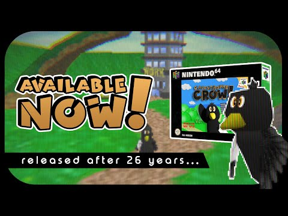
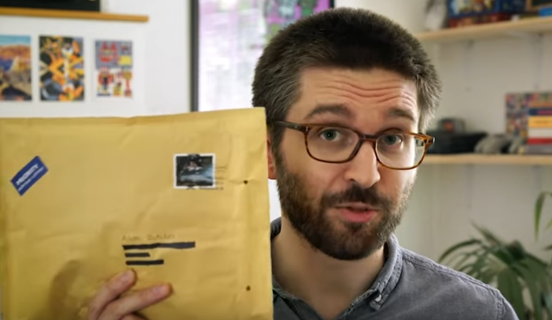
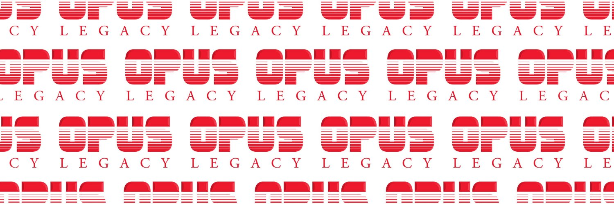
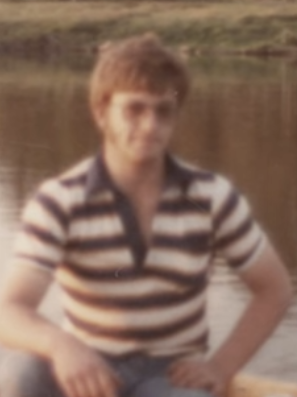
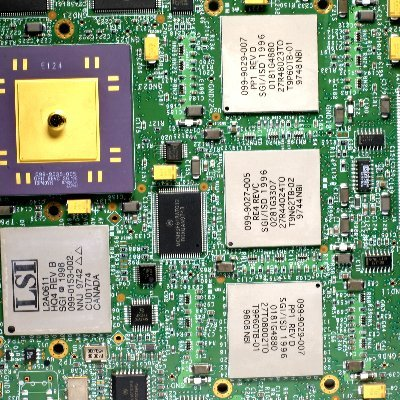

title: Game
# The 2024 Game Release Info Recap

!!! warning "On-going!"
    This Section of the ARG is still on-going! We will update as soon as more Info is revealed and is available!

## Resources

- [Link to the game on Itch.io](https://opuslegacy.itch.io/play-catastrophe-crow)
- [Discord server](https://discord.gg/hS4GWe8Fqg)
- [The original document for the ARG](https://misaelk.github.io/crow64-doc/) or Visiting The [Main page](main.md)
- [The document dedicated to the Unity dump at the end of the ARG](https://docs.google.com/document/d/18z0adLZBWKhC6KRewwKxsHITQE1ftHwSn4FsHcbmK84/edit)

## Whats this?

This document is created and updated by the Catastrophe Crow community members to document the 2024 game Catastrophe Crow, an official playable version of the fake canceled Nintendo 64 game featured in the past "WHAT HAPPENED TO CROW 64?" mockumentary and ensuing ARG, from 2020.

!!! danger "Fictional"
    To be clear, Catastrophe Crow, Manfred Lorenz, and the events surrounding them are entirely fictional, but this document will generally discuss them as if they were real for convenience. 
    
    Adam and Luke Butcher are genuine individuals who have done a multitude of work outside of Catastrophe Crow. In addition, while there are interactable elements,  **Please use caution when interacting** . 
    
    We do not want to bother individuals not connected to the ARG accidentally. There is an honest company named Opus Interactive, but it is utterly unrelated to the OPUS Interactive or OPUS Legacy of Catastrophe Crow.

# Videos

## CATASTROPHE CROW Release Video
!!! tip "Video info" 
    {float=left width="300"}<ul> <li> Date - April 27, 2024 10:00 PM (UK)</li> <li>Link: [CATASTROPHE CROW Release Video](https://www.youtube.com/watch?v=aBBgPVYz7hQ) </li> <li>Description: [https://opuslegacy.itch.io/play-catastrophe-crow](“https://opuslegacy.itch.io/play-catastrophe-crow”)</li></ul>  

### Brief Video Recap

!!! warning "TBA"
    No info yet

# Known Characters

!!! note "Extensive Details"
    More detailed explanation about The Characters can be found in [The Characters Section of The Main doc](main.md#characters)

## Where we left off

### Adam Butcher 

{align=right width="250"}**Adam Butcher** - A filmmaker. Researched and created "WHAT HAPPENED TO CROW 64?" in October of 2020, bringing attention to a lost game and kickstarting the ARG. Made no comments about the secrets that were uncovered. He remained generally silent about CC64 until August 2023, when he received [a letter from OPUS Legacy Co](https://twitter.com/AdamButcherFilm/status/1691817580183339419).

  

### Opus Legacy Co

{align=right width="300"} **OPUS Legacy Co.** - OPUS Interactive was the original studio behind Catastrophe Crow, but dissolved. OPUS Legacy first appeared publicly when they began correspondence with Adam Butcher in 2023, to organize a Makeship campaign for a Crow plushie and work on a revival of the original game. We have no idea who's running this company.

  

### Manfred Lorenz

{align=right width="170"} **Manfred Lorenz** - The creator of Catastrophe Crow and lead programmer at OPUS. When his daughter passed away, his mental state deteriorated and he took full control of the game's development, laying off the rest of his staff. He worked on the game alone for months before disappearing with almost all development materials. His boat was found empty, except for a note to his wife, and he was believed to have drowned himself. During the original ARG, players learned that he was responsible for uploading footage of the game to YouTube, and even had a chance to speak to him. The ARG ended with what appeared to be him passing on.

  

### Nils Lorenz

**Nils Lorenz** - Manfred's son. Email correspondence with Manfred suggested that Nils remained alive, but he has never shown himself. 
  

### Ulrich Aderman

{align=right width="180"}**Ulrich Aderman** - A former employee of OPUS Interactive. Noticing discussion of the game online, he posted an encrypted copy of his workstation's hard drive, which the community managed to decrypt, ending the initial ARG. Ulrich is presently retired and with family, [he has no idea who is behind OPUS Legacy](https://twitter.com/AdermanUlrich/status/1711384865331900664). 

    

## Within The Game

### Mr.Crow 

**Mr. Crow** - The game's protagonist, a wounded crow unable to fly. The character comes from a drawing by Thea Lorenz, and so he's often used as a stand-in for her.

### Father Crow

**Father Crow** - A larger crow with glasses. A stand-in for Manfred.

### Scarecrow and Crawler

**Scarecrow and Crawler** - Two dark skeletal figures wearing sacks on their heads. One stands upright and with its arms outstretched, the other stays down on the ground. A family picture of Manfred, Thea, Marta, and Nils was once seen replaced by one of Father Crow, Mr. Crow, the Scarecrow, and the Crawler in the exact same positions respectively. 

### Brother Crow

**Brother Crow** - A stand-in for Nils, smaller than Mr. Crow. Since he isn't wounded, the player is able to fly when controlling him.

  

# Game WalkThrough

!!! warning "TBA"
    No info yet

# Ciphers

!!! note "Extensive Details"
    More Detailed Explanation about The Ciphers can be found in [The Known Ciphers Section of The Main doc](main.md#known-ciphers)

## Crow language

{width="180"}
{width="180"}

!!! tip ""
    Crow language is a basic substitution cipher that was prominent in the original ARG. It's notably designed so that the names of Manfred's children correspond to the word CROW (where "CROW" in plaintext becomes "NILS" in crow language, and "THEA" in plaintext becomes "CROW" in crow language).

The specific substitutions are:

!!! tip ""
    **A B C D E F G H I J K L M N O P Q R S T U V W X Y Z (Crow language)**   
    **S F T Z L Q U I R V Y O J C E X M H W N P B A D K G (Plaintext)**

[You can find a simple translator for it (and a guide on Vigenère ciphers) at this webpage.](https://adam.levav.net/CrowCiphers/    )
