Title: Main
# Crow64 Recap

!!! tip ""
	This Page Includes all Info about The Crow64 ARG, That includes Lore and Ciphers

### Known Videos (as of 27th March, 2021)
[Playlist of all Videos](https://www.youtube.com/playlist?list=PLtVj3PkAEtzYxeIlkN7QHpbMrvOkAGZae)

* [WHAT HAPPENED TO CROW 64?](https://www.youtube.com/watch?v=irEb9TS9yEk) by AdamButcher
* [Catastrophe Crow N64](https://www.youtube.com/watch?v=RxWT200i0hk) by 3D Platformers NZ
* [Video](https://www.youtube.com/watch?v=Uky7-lSOnq0) by 3D Platformers NZ
* [Catastrophe Crow! – Underground Level](https://www.youtube.com/watch?v=UF5THpGez-w) by Childhood Memories 64
* [catastrophe crow n64 playthrough](https://www.youtube.com/watch?v=mbhYLxrcLPI) by N64 Long Lost Lore
* [cc64 menu](https://www.youtube.com/watch?v=4K0YqRu-TKw) by N64 Long Lost Lore
* [Let's Play Catastrophe Crow! 64 – Ep1](https://www.youtube.com/watch?v=ji8bV6uZGnc)by 90sRetroGamingFRed
* [Let's Play Catastrophe Crow! 64 – Ep2](https://www.youtube.com/watch?v=mVOIGCX5ZYs) by 90sRetroGamingFRed
* [Catastrophe Crow!: N64 Gameplay](https://www.youtube.com/watch?v=qavFycSelaU)by N64ExcavationMan
* [Forest Level](https://www.youtube.com/watch?v=tA3Ju4DqmOo) by N64ExcavationMan
* [End Credits Soundtrack (1995)](https://www.youtube.com/watch?v=w_6YDLhhV2w) by Ultra 64 Forever
* [_](https://www.youtube.com/watch?v=4RktfCzZd8Q) (Oct 29) by Ultra 64 Forever
* [_](https://www.youtube.com/watch?v=ImhNwENFZjQ) (Nov 4) by Ultra 64 Forever
* [“Catastrophe Crow!” Development Documents](https://www.youtube.com/watch?v=h1kx_VlFBio) by Ulrich Aderman
* [°](https://www.youtube.com/watch?v=Rr51gElUx3s) (Nov 23) by Ultra 64 Forever
* [“Catastrophe Crow!” Development Documents 2](https://www.youtube.com/watch?v=BkYtmKW-mfM) by Ulrich Aderman
* [°](https://www.youtube.com/watch?v=rWbVr5icZ5Y) (Dec 5) by Ultra 64 Forever

### Resources
 - [Subreddit](https://www.reddit.com/r/CatastropheCrow/)
 - [Discord](https://discord.com/invite/VBQ5SJHMyz)
 - [TvTropes](https://tvtropes.org/pmwiki/pmwiki.php/WebVideo/CatastropheCrow)
 - [Major Links](https://tuwuppy.github.io/cc64majorlinks/)
 Follow One of The Above resources to keep up with the story!


##### Whats This?

This document is created and updated by members of the Catastrophe Crow community to follow the alternate reality game centering on the eponymous game. 

!!! note "ARG?"
	An alternate reality game, or ARG, is a story that claims to be real and features audience interaction, sometimes interacting with the real world. “Catastrophe Crow!”, or “Crow 64” is a fictional game developed by Manfred Lorenz and Opus Interactive for the Nintendo 64. Opus Interactive went under, the game got trapped in development Hell, and until recently, Manfred Lorenz was believed dead. Adam Butcher’s research and resulting video “WHAT HAPPENED TO CROW 64?” brought attention to this game, and community has formed around documenting its peculiarities and the events surrounding it.

!!! warning "Warning!"  
	To be clear, Catastrophe Crow, Manfred Lorenz, and the events surrounding them are completely fictional, but this document will generally discuss them as if they were real for convenience. Adam and Luke Butcher are real individuals who have done a multitude of work outside of Catastrophe Crow. In addition, while there are interactable elements, please use caution when interacting. We do not want to accidentally bother individuals not connected to the ARG.There is a real company named Opus Interactive, but it is completely unrelated to the Opus Interactive of Catastrophe Crow.

This document aims to do the following:

- Document the game Catastrophe Crow and the story around it
- Research and explain their oddities
- Collect the research in an easily accessible manner

# Known Ciphers

!!! note ""
	An online C# decoder is available for both of the text based ciphers, usage should be fairly self explanatory: simply change the parameters for functions like CrowTranslateFrom or CrowDecipher. [Link to decoder here](https://dotnetfiddle.net/b7qC7v).

### Crow Language

Some text that appears in the game might appear garbled / nonsensical, this is most likely due to it being in *“Crow Language.”*

**[catastrophe crow n64 playthrough](https://www.youtube.com/watch?v=mbhYLxrcLPI) by N64 Long Lost Lore** includes the Pause screen both pre-garble (at 0:30) and post-garble (at 3:00), using these two bits we can build a map between the regular alphabet and the Crow alphabet. Letters not present in this screen have been deduced over time by filling in the blanks when deciphering various messages.

{width="150"} {width="150"} 

!!! note "Latest letter map (top is ciphertext, bottom is plaintext):"
	**A B C D E F G H I J K L M N O P Q R S T U V W X Y Z**

	**S F T Z L Q U I R V Y O J C E X M H W N P B A D K G**

For example, if you start with the word “password,” you would replace each letter with a letter from the top row as seen in the table below.

{width="150"}

The result is “UWAASLIX.” This can then be decoded back into “password” by replacing each letter from the top row with one from the bottom row, or in other words doing the same process in reverse.

Interestingly, “Thea” encodes to “Crow,” “Crow” encodes to “Nils,” and “Nils” encodes to “Thea” in Crow Language.

!!! tip ""
	An easy online converter can be found [here](http://adam.levav.net/CrowCiphers/).

### Vigenere Cipher

In case a series of digits is stumbled upon, it’s most likely that it can be used to decode into another piece of text. One such series can be found in the video [WHAT HAPPENED TO CROW 64?](https://www.youtube.com/watch?v=irEb9TS9yEk) by AdamButcher (at 4:22). The table for decoding text that uses this cipher appears in [Forest Level](https://www.youtube.com/watch?v=tA3Ju4DqmOo) by N64ExcavationMan (at 3:38).

Series of digits are used as values for the Y axis while repeating characters of a keyword, all of which so far being a person’s name are used for the X axis. Currently discovered functional keywords are Nils, Thea, and Crow.

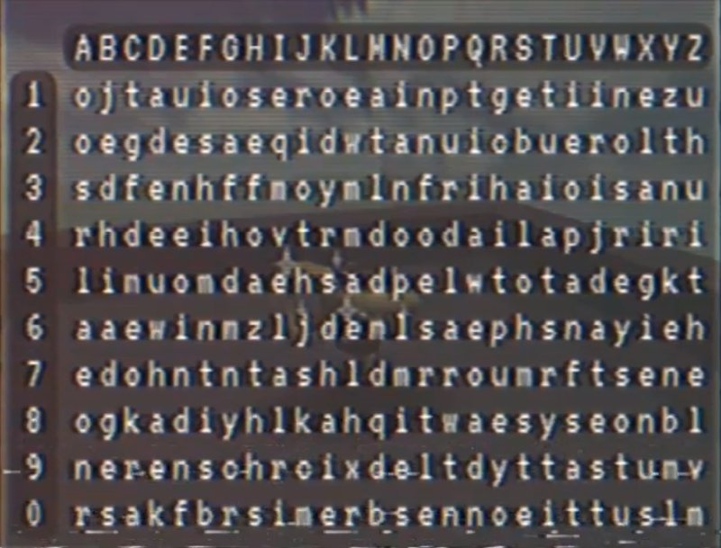{width="500"}

!!! tip "Deciphering Example"
	Digits: 30781354841

	Name: NILS

	For the first letter of the result, take the letter from row 3 column N, then row 0 column I, etc. In most cases the name will be shorter than the amount of digits, in that case just keep repeating it. The “full name” for the above cipher can be understood as NILSNILSNIL.

	After deciphering we get the result NILSIMALIVE.


### Keyboard Sound Cipher

In [Catastrophe Crow! – Underground Level](https://www.youtube.com/watch?v=UF5THpGez-w) by Childhood Memories 64 from 0:49 onwards, the Crow steps on various keys on a computer keyboard. Each sound corresponds to one letter. Using these sounds, one can map audio cues in videos like [Video](https://www.youtube.com/watch?v=Uky7-lSOnq0) back to Crow Language and then to regular words. A soundboard with all the individual sounds is available [here](https://blerp.com/soundboard/5f8ab81eea7ee1000f0be654).

The first letter of a sound’s name often corresponds to the keyboard letter that makes it. For example B for Bell, P for Phone, etc.

### Ocean Quest Cipher

{width="500"}

| Notes       | Letters                              |
| :---------- | :----------------------------------- |
| `C3`        | A  |
| `C#3`       | B |
| `D3`    | C |
| `D#3`    | D |
| `E3`    | E |
| `F3`    | F |
| `F#3`    | G |
| `G3`    | H |
| `G#3`    | I |
| `A3`    | J |
| `A#3`    | K |
| `B3`    | L |
| `C4`    | M |
| `C#4`    | N |
| `D4`    | O |
| `D#4`    | P |
| `E4`    | Q |
| `F4`    | R |
| `F#4`    | S |
| `G4`    | T |
| `G#4`    | U |
| `A4`    | V |
| `A#4`    | W |
| `B4`    | X |
| `C5`    | Y |
| `C#5`    | Z |


# Characters

## Human Characters

### Manfred Lorenz

{width="300}

*Pronounced [man.frɛt lɔ.rɛnts] (maan-fret lau-rents)*

The illustrious creator of Catastrophe Crow and Ocean Quest and lead programmer at now-defunct Opus Interactive. Noted perfectionist, and receiver of two Golden Joysticks and an AIAS Hall of Fame Award. Late in development of Catastrophe Crow, his home life had fallen apart and he had not seen his family for months. In the final months he was the final and only developer on the project as all other staff members were let go.

Believed to be dead after his disappearance off of Cuxhaven. He left a cryptic note to his wife that said, among other things, that he had finally gone home. Recent email correspondence with a “M L” suggests he is still alive and aware of the search around Catastrophe Crow. The names of the channels can also be merged together to form his name, and M L comments about them confirm that M L created them.

!!! danger " "	
	Retrogamingcollectibles, the eBay seller who sold Adam’s cartridge, is believed to be Manfred and intended to sell the game to Nils,but Adam bought it instead.

Evidence for M L being Manfred Lorenz:

- Initials match
- M L speaks of Marta in the third person
- Speaks to Nils as a family member
- Familiar with the events surrounding Catastrophe Crow
- Apologizes to a former Opus employee


### Marta Lorenz
*Pronounced [maː.ta lɔ.rɛnts] (mah-tah lau-rents)*

Left the country before Manfred’s disappearance, and was the addressee of his last letter. Her current whereabouts are unknown.

### Thea Lorenz
*Pronounced [tʰɛa lɔ.rɛnts] (teh-ah lau-rents)*

Drew the original drawing that inspired Catastrophe Crow.

!!! danger " " 
	Possibly dead.

### Nils Lorenz
*Pronounced [niːls lɔ.rɛnts] (neels lau-rents)*

The emails from M L suggest that Nils is alive, or if he was incapacitated he was still in a state where it would be reasonable for him to be alive. His current whereabouts are unknown. He isn’t mentioned once in WHAT HAPPENED TO CROW 64?

### Adam Butcher

{width="300}

A youtuber, writer, and director who helped create WHAT HAPPENED TO CROW 64?, the video which started this community. Despite his research and role in Catastrophe Crow’s attention, he hasn’t made few public statements about the game since his original video, aside from a [tweet](https://twitter.com/adambutcherfilm/status/1342482500266946560?s=21) acknowledging a fanzine.

### Luke Butcher
{width="300}

Brother of Adam and co-creator of WHAT HAPPENED TO CROW 64? He’s a doctor of theoretical physics.

### Ulrich Aderman
*Pronounced [ʊl.ʁɪç adɐ.man] (ul-rish aada-maan)*

Former Lead Programer at Opus Interactive and owner of a [Twitter account](https://twitter.com/AdermanUlrich). Possesses game develop documentation and an old workstation from which he dumped the rom for the game. He’s been oddly quiet since doing so, not replying on Twitter for over a month.

## Crow 64 Characters

### Mr. Crow
{width="300}

The protagonist of the game. Has typical platformer skills, including ledge grabbing, wall jumping, and a triple jump aided by his wings. Due to an injury, he is unable to fly, and his left wing is held in a bandage.

!!! danger " "
	Generally agreed to represent Thea Lorenz.

His name is given as “Mr. Crow” in the Planet 64 scan, but simply as “Crow” in N64 Future Look. As the first was from 1997 and the second from 1999. His name is given as “Mr. Crow” and gender as male in this document for the sake of clarity. Thea’s drawing gives his name as “Katastrophe Krähe [sic]”, which is German for “Catastrophe Crow.”

!!! danger " "
	it is possible that his name was officially changed between the two articles. This could also suggest that Manfred had begun to project Thea more onto Mr. Crow

Evidence supporting Mr. Crow representing Thea:

- She created the original design for Catastrophe Crow.
- This is only for your little brother now.” from Keyboard Cipher #1 suggests that TheaLorenz is dead.
- In Crow Language, “Thea” becomes “Crow”.
- Dead Crow appears in a room that has Thea’s original Catastrophe Crow drawing, which also suggests that Dead Crow is Thea.

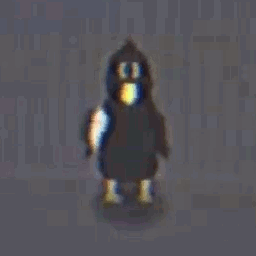{width="300}
{width="300}

### Brother Crow

The Brother Crow appears in Let’s Play Catastrophe Crow! Ep. 1 and Forest Level after Mr. Crow interacts with the mirror in the Forest Level. Unlike Mr. Crow, he is missing the bandage on the right wing, has green eyes, and is also shorter. Unlike Mr. Crow, he is able to fly, with no apparent limit seen so far, allowing him to travel to parts of levels that Mr. Crow is unable to reach.

!!! danger " "
	Almost certainly a separate character from Mr. Crow, and possibly the same character as Crawler. He is believed to represent Nils

Evidence supporting Brother Crow representing Nils:

- horter than Mr. Crow, paralleling how Nils was shorter than Thea
- Father Crow’s comment about how “you always looked alike” in Let’s Play Catastrophe Crow! Ep. 1. If Thea is Mr. Crow, then it follows that Nils’s representative looks like Thea’s.
- “Nils” in Crow Language decodes to “Crow” in plaintext.
- Inside the Unity project he is called “Brother Crow.”

### Father crow
{width="300}

A glasses-wearing older crow, presumed to be the father of Mr. Crow. No official name known. Briefly becomes the player character at 11:26 in WHAT HAPPEND TO CROW 64 until the end of the video after Mr. Crow falls down the stairs. He also jumps off his boat earlier in the video.

!!! danger " "
	General consensus among the researchers is that he represents Manfred

Evidence supporting the Manfred=Father Crow Theory:

- Father Crow jumpingoff a boat with computer equipment in WHAT HAPPEND TO CROW 64, paralleling Manfred’s disappearance and presumed death in the North Sea.
- Is the only worker at the “work building,” and is apparently a programmer.
- Is a father, like Manfred.
- Fits in with the general consensus that Mr. Crow represents Manfred’s child.
- Wears glasses, like Manfred.

### Dead crow
{width="300}

What appears to be a heavily injured crow, found at the end of WHAT HAPPENED TO CROW 64? Dead Crow is also the Crow that appears most like a real-life crow, ignoring the missing head.

!!! danger " "
	Possibly represents Thea Lorenz, and may be the same as Mr. Crow since Dead Crow only appears when Father Crow is the played character. Notably appears in a room that has Thea’s original drawing. Missing head Perhaps the person it represents had a head injury?

### Creatures
{width="250"}
{width="250"}
{width="250"}
{width="250"}
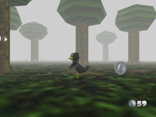{width="250"}

Various NPCs featured in Catastrophe Crow. Their names are as below, listed from left to right.

- Scarecrow
- Crawler
- Monks
- Flying Fish
- The Trees

Scarecrow (who first appeared at 7:50 in WHAT HAPPENED TO CROW 64?) and Crawler appear after Mr. Crow falls down the stairs and approaches him. The bags over their heads are called “money bags” in the Unity Dump.

!!! danger " " 
	The family photo in Catastrophe Crow N64 suggests that they represent Marta and Nils respectively. Crawler also bears resemblance to Scarecrow.

Monks appear in the Planet 64 scan, 2:09 in WHAT HAPPENED TO CROW 64?, and briefly at 0:45 in Video. They appear in both a large <span style="color:red"> (about five times Mr. Crow’s height) </span> and small <span style="color:red"> (about five times Mr. Crow’s height) </span> sizes. The Flying Fish appear in WHAT HAPPENED TO CROW 64? at 2:08 and Let's Play Catastrophe Crow! 64 – Ep1 starting at 1:58. In contrast to real fish, which have vertically oriented tail fins, the Flying Fish have sea mammal-like horizontally oriented tail fins. The Trees appear in “Catastrophe Crow!” Development Documents and turn to face the player. Their eye is called EvilEye in the Workstation Dump.

### Sir Cat
{width="100}

The original intended villain of the game. He has not made an appearance in any of the videos or scans.<span style="color:red"> His name sounds a lot like “circuit.”  </span> The only reference to him in the Unity files are the “Catanic Circles” found in Toy Land’s directory.

### Pawns

Appears briefly in WHAT HAPPENED TO CROW 64? and ° (Nov 23). Considering the “credits” scene from the workstation dump

!!! danger " "
	they are believed to represent Opus Interactive’s employees.

### Teddy Bear

Appears most prominently in Let's Play Catastrophe Crow! 64 – Ep2, ° (Nov 23), and ° (Dec 5), where it gives a code. In the workstation dump it’s called “player,”

!!! danger " "
	suggesting that it represents the player, whether that be players of Catastrophe Crow in-universe, the participants of the ARG, a specific individual such as Thea or Nils, or some combination of those possibilities.The fact is is replaced briefly with Brother Crow and a Pawn in ° (Nov 23) leads credence to the idea that Teddy Bear represents more than one thing. It may have a second meaning as it is a repeated prop

# E-mails

!!! note "Email Censoring"
	M L’s email has not responded. Stop emailing it. Stop asking about it. Whatever you are thinking has already been done twice over. Do not try to extract private information from it or hack it. Irresponsible activity is why we can’t have nice things.

A handful of the channels contain made up e-mail addresses on their About page.

- **[Removed due to irresponsible activity]**@gmail.comfor N64 Long Lost Lore

- **[Removed due to irresponsible activity]**@gmail.comfor N64ExcavationMan

- **[Removed due to irresponsible activity]**@gmail.comfor 3D Platformers NZ

- **[Removed due to irresponsible activity]**@gmail.comfor 90sRetroGamingFRed


A hint encoded in Crow and also the Vigenère Cipher (decode in reverse order) in another video states “Join e-mails in order.” 

Out of all the possible permutations of the parts preceding @gmail.com, only [Removed due to irresponsible activity]@gmail.com is a real address. 

At around 8 AM UTC on 17th October, the address began responding with replies such as “Who is it?”. The emails were shown to come from an M L. After replying with “Nils,” user Medley (Mikel) received the following response:

{width="100}

After replying, it appears the emailer wants to know Nils’ birth date and location where they holidayed each year. So far the date Nov 5th is confirmed as incorrect for the birth date. This date was guessed from the dates listed on the front of the prototype cartridge in the documentary video. The locations Cuxhaven and Bispingen/Wilseder Berg also appear incorrect. The guess of a forest in Italy, presumed to be Vallombrosa, has not been confirmed as right or wrong.

!!! danger " "
	 Given the initials of ML and responses it appears this is Manfred Lorenz looking for Nils for an unknown reason. He also set up at least the four Youtube accounts that the email address used as well as the initial eBay auction.

## Email Transcripts

!!! tip ""
	This is transcripts of all emails that have received replies from ML. Attempts made that did not receive a reply are not recorded below as without a reply there is no information on ML to be added.. 


!!! quote "Nils" 
	Three reply variations have been received. The first from user Medley (Mikel)

	ML: Nils… Is this really true?

	*Replied back to ML that it was.

	ML: My dearest boy,

	After all these years I have much to say,

	Your birthday is not too far from now. I hope we can meet the day after? In the place we holidayed every year?

	I will be there.

	M

	A reply was made with Nov 5th as the birthday, and Cuxhaven and Bispingen/Wilseder Berg as the holiday locations.

	ML: I wish to believe you, but can no longer make the leap.

	I understand now that this has met many more eyes then those for which it was intended. I can only hope the true recipient is among them

	I will be waiting

	The second was from user Sr Esteban.

	10/18 8:52 AM CST

	N: I have so many questions...

	first of all..

	Is this really you?

	10/18 9:48 AM CST

	ML: My dearest boy, I so wish to believe it is you,

	To have come this far, you must understand me somewhat. But there is much to discuss.

	I hope we can meet? I have been thinking the day after your birthday, in a place we holidayed every year.

	I will be waiting.

	M

	10/18 12:34 PM CST

	N:I want to meet!

	Its been so long… and I was young the last I knew you. A lot of repressed memories. Could it be the forest in Italy?

	10/18 3:09 PM CST

	ML: I am sorry. I want to take a leap of faith...but the chasm grows ever wider.

	There are too many prying eyes, I need proof you are who you say you are,

	You would not have forgotten your birth date.

	M

	A reply was sent stating November 5th for the birth date.

	ML: Another imposter.

	I can only hope that he wishes to remember me. And that among the prying eyes he is one of them.

	Until then, I will be waiting.

	The third was sent by user 7k. This was sent from an account showing the name Nils L. and was attempted to ask questions preemptively of ML for additional information.

	10/18 8:29 PM

	Nils L: I feel like I’m losing my mind. Is this real? Are you trying to contact me?

	10/19 6:46 AM

	M L: Is this truly Nils?

	Are you out there, reading this somehow?

	Or have you chosen not to remember me?

	10/19 1:37 PM

	Nils L: Well my name is Nils Lorenz, I was born in Germany where I lived when I was really young, and my father was a game developer named Manfred, I even distinctly remember the Crow character, but my father died when I was very young. At least that’s what my mother always told me. I’ve been seeing these videos of this incredibly familiar game, with strange messages that seem like they’re aimed at me, but I’m unsure what to think of it. I don;t know how to feel about this situation and I don’t know if I can trust you. I feel like I’m dreaming. Is there anything you can do to clear this up for me? Is there anything you can tell me so I know it’s you? Something from my childhood. Where did my sister go to school? Where did we vacation. What was our house like?

	10/19

	ML:You speak like him, as I imagine he would. With questions painful to answer.

	But the imposters multiply, I feel I cannot take another step.

	All I can do is wait. Perhaps it is just a little longer.

	10/20 10:49

	Nils L:I guess that’s understandable, but know I am being honest. This whole situation is gnawing at the back of my mind, and I’ve been struggling with how to handle everything. I’d like answers. But if you feel unsure I understand, as I feel the same way. Take as much time as you need. I will be here. Waiting.

	10/21

	M L: I see us standing on either side of the chasm. Neither alive or dead. But the gap only grows wider.

	We have all waited too long.

	It is the cruelty


!!! quote "Marta" 
	Sent by user ParadoxFactor. This was done to help determine if M L was Manfred or Marta

	10/17 4:48 PM PST

	ML: Who is this?

	10/18 1:31 PST

	Marta: It's Marta.

	10/18 12:58 AM PST

	ML: I doubt that very much.

	10/18 9:24 PST

	Marta: It is me. I saw the video online and had to reach out.

	10/18 2:22 AM PST

	ML: My doubt remains. She never solved anything.

	10/18 11:09 PST

	Marta: Your right. Nils solved it but didn't want to send a message. So I am instead.

	10/18 7:34 AM PST

	ML: That is possible... But there can be no intermediary.

	After all these years, you would still not understand.

!!!quote "Manfred"
	Sent by user Vicky. Initial message indicated they were lost

	Lost Soul:What are you trying to tell me?

	ML:What do you mean?
!!!quote "Kaleb, a video game enthusiast"
	K: Hello, my name is Kaleb, growing up my favorite genera of game was the 3D platformer and the genre still remains in a special part of my heart today. I’m always looking for a classic platformer I haven;t played yet, so when a game I never heard of stared popping up in my recommendation box it instantly got my attention and I was intrigued to find out that these videos had hidden messages in them. You may have seen some of my comments on some of the videos picking apart their puzzles. I now realize that while these videos are public these messages weren’t intended for everyone. But still, I am touched by your story from what I can make of it. So if there is anything I can do to help please let me know.

	ML: Kaleb,

	Perhaps in another life we would have been friends

	But this remains a private matter. Your help would be of no use to me.

	M
	K: Fan art 
	{width="250"}

!!!quote "A previous employee of Opus Interactive"
	Sent by user Rainbow

	10/18 1:06 AM PST

	ML: Who is this?

	10/18 10:01 AM PST

	Employee: this is one of Opus Interactive’s previous employees.

	10/18 1:12 PM PST

	ML: Then all I can say is I am sorry.

!!!quote "Fred Daves, a YouTuber playing Catastrophe Crow"
	Sent by user Flamsy to look like they are connected to the YouTube channel 90sRetroGamingFRed

	Fred: Hey I heard you are the creator of a game called Catastrophe Crow! 64. I’m playing it on my channel, and I am having a blast!

	Fred: Hey… mind if I ask you a few questions? The game is acting a bit… strange.

	ML: “Fred”

	Whatever I create I can no longer control.

!!!quote "A concerned father"
	Sent by user Sir Dibs. He sent in as his own account not posing as anyone else. The title of the email was Crow64

	Sir Dibs:I have heard about your desire to meet with your long lost son Nils through others.

	As a father, I understand this desire and would like to offer my help in finding him. I fear your proposed meetup may not have reached him.

	Is there anything you can tell me about Nils to help me locate him and get your messages to him?

	I apologize for the invasion of privacy but your message seems urgent and many are concerned.

	ML:There has been a grave mistake. The game you mention is unreleased. It is not meant for you.

!!!quote "N64 Long Lost Lore"
	Sent by user prlennox. This is the name of one of the Youtube channels with videos of Catastrophe Crow 64.

	N64LLL: Hello, I'm "N64 Long Lost Lore"! I've been recently playing one of your games (Catastrophe Crow) on my channel and it's been pretty fun! It reminds me of numerous other platformers, yet it's bigger and better than them. I've been looking into the company you managed and worked on the game (Opus Interactive) and I found another game you worked on, "Ocean Quest". Another channel like mine uploaded a song from the game. I'm curious if you have any more information on it, since I was quite fascinated by Catastrophe Crow. So if you don't mind, could you share some details with me? Thanks!

	ML: And “Lore”

	Another creation running by itself

	N64LLL: Someone was recently selling a development of Catastrophe Crow on the site ebay.com 2 weeks ago. For details, it had a label with numerous dates on it on the bottom, and it had "CROW" written in sharpie on the top. I was about to buy it but someone bought it before me, right after I discovered the Ebay page, to be exact. But here's a screenshot I took before they bought it.

	A screenshot of the eBay auction from the documentary was included.

	Would you happen to know information about who bought it, or the seller? Really just any information you happen to know about the cartridge sold on Ebay? If so, please share the information with me! Thanks!

	ML:So he never received it...

	It is all so long ago now. Long lost.

	10/19

	Mr QuartzSent by user SirDibs. Was sent to see the reaction if offered help in locating Nils.

	Mr. Q: I have heard about your desire to meet with you long lost son Nils through others.

	As a father, I understand this desire and would like to offer my help in finding him. I fear your proposed meetup may not have reached him.

	Is there anything you can tell me about Nils to help me locate him and get your messages to him?

	I apologize for the invasion of privacy but your message seems urgent and many are concerned.

	10/19

	ML:Mr Quartz -

	If he does not wish to remember me, I do not wish to be remembered.

	I will remain here.

	MM Sent by user Medley (Mikel)

	MM: Dear M L,

	We are trying to help Nils get in touch with you, does he have access to all the information he needs to try and meet up with you? Or does he need to wait longer to prove himself?

	Thanks,

	MM

	ML:I wish your help was of use to me. If only it were so simple.

	It is the cruelty of unfinished things

### Email silence and mass reply from ML
From October 21st to December 5th, no replies were received from ML, despite many email attempts. After a Discord user attempted to access the account via a password reset, the email address was removed from this document.

{width="100}

On December 5th, a wave of emails was sent out as the Unity project file from Ulrich was cracked. Everyone up to then who had emailed ML, regardless if he had previously replied to them, received an identical .wav filetitled °. This file contained a coded audio message. When translated it created the image to the right. This was determined to likely be a pyramid.


!!! danger " "
	This image may have been intended as a hint at part of the password to access the Unity files. One of the keywords needed for the password was tomb and Egyptian pyramids were built for that purpose.

*Since this mass email, no further replies have been received from ML.*

# Video Findings

## WHAT HAPPENED TO CROW 64
{width="100}

### Unknown Floor

At 1:05, one of the screenshots shows stairs with a blue carpet, something not seen in either of the floors of Work seen on video so far.

### 鴉 64
{width="100}
At 1:27, the display uses the uncommon kanji “鴉” instead of the katakana spelling “カラス,” which is how it’s spelled in modern Japanese and would also be a transliteration of the English word “Crow.”

### Note from The boat
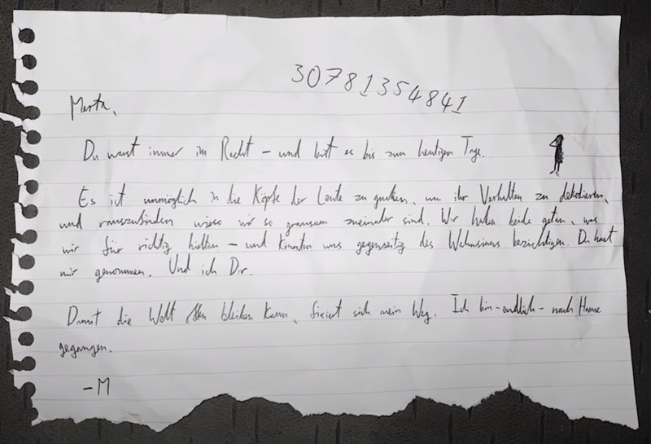{width="100}
At 4:20 in the video, a death note from the game’s lead developer Manfred Lorenz appears.

The digits in this note can be used in the Vigenère Cipher, depending on the Name we used for deciphering we can arrive at various results:<br></br>
    Nils ➡ Nils I’m alive <br></br>
    Thea ➡ Is not for you<br></br>
    Crow ➡ For other kin<br></br>

!!! quote "Manfred's last note translation (by Quinn)"
	Marta,

	You were always in the right — and remain it till the last day.

	It's impossible to look into people's heads to decode their behaviour; to find out why we are so cruel to one another. We both did what we thought was right — and yet, we could accuse one another of insanity. You have only taken from me — and I from you.

	So the world can remain open, my path is set in place. I have — finally — gone home.

	-M

!!! quote "Transcription"
	Marta,

	Du warst immer im Recht — und bist es bis zum heutigen Tage.

	Es ist unmöglich in die Köpfe der Leute zu gucken, um ihr Verhalten zu dekodieren, und rauszufinden wieso wir so grausam zueinander sind. Wir haben beide getan, was wir für richtig hielten — und könnten uns gegenseitig des Wahnsinns bezichtigen. Du hast mir genommen. Und ich Dir.

	Damit die Welt offen bleiben kann, fixiert sich mein Weg.Ich bin — endlich — nach Hause gegangen.

	-M

!!! danger " "
	“Fixiert” is also used to mean “fixated,” as in “to be fixated on something.” The phrase is oddly worded,meaning that this could have a double meaning.

### N64 Future Look
{width="100}

*Here we can see the lava and ice worlds briefly shown in Video*

Contradicting Planet 64, the main character’s name is simply given as “Crow” here.  

“The more we explored, the more we’ve got a sense of the game hiding something larger...cryptic clues in character dialog, a strange code found in forgotten corners of the levels, even a bizarre sci-fi pyramid filled with hieroglyphics.” 

!!! danger " "
	The Contradiction in Planet 64 perhaps hints to a name change in the 2 years that had passed?
	The quote indicates that even before the original release date, there were unusual elements in Catastrophe Crow. The sci-fi pyramid also sounds a lot like the area found at the end of Forest Level.

### Like Something was Following Me 
{width="100}
At 2:49, CCgefickt says that there were “weird glitches like something was following [me],” “even early levels were not working right,” and that he had “not programmed for weeks,”. The three developers posting on this unknown forum are “devAnonym,” “CCgefickt,” and “OpusKunst.” “Gefickt” is German for “fucked” and “Kunst” is German for “art.”

!!! danger " "
	suggesting that even before the layoffs, programming was increasingly under the sole control of Manfred.
	
### Developer Cartridge
{width="100}
At 4:58, a picture of a Catastrophe Crow dev cart is shown. The dates on the bottom arebelieved to be build dates, and are documented in the Timeline later in this document. On top is the label: “NUS-16F32S 256M+256K.” This means:

- NUS: cartridge requires the Jumper Pak (as opposed to the Expansion Pak games like Donkey Kong 64 used.)
- 16F32S: this is a prototype/developer cartridge.
- 256M+256K: this game operates with 256 MB storage.

### Crow Language Note Template

At 5:30 in the video, before the game boots up, a template for a note written in Crow Language appears. The missing text is scattered within hints throughout other videos. Thanks to each line being a different length, piecing the note together once all the hints are found is straightforward.

The line lengths are: 11, 34, 13, 10, 9, 14, 30, 15, 27, 24, 3, 33
{width="100}
The full note reads, with the filled in boxes bolded:

!!! quote " "
	Dearest Thea
	I am sorry I coul**d** not b**e** with you in the end

	I w**a**s too afraid

	I **r**an and now

	I am in h**e**ll

	One I made my**s**elf

	I dreamed of you playing **t**his one day

	But you **n**ever will

	Please forg**i**ve me my little crow

	P**l**ease forgive me both of you

	Dad

	This i**s** only for your little brother now

!!! quote "In Crow:"
	XOWIOACCROW

	HWQALIIKHNLGEXTLCVOSHCRKLGHTCROOTX

	HSWACLLWBIWHX

	HIWTWTXTLS

	HWQHTROEE

	LTOHQWXOQKAOEB

	HXIOWQOXLBKLGUEWKHTZCRHALTOXWK

	VGCKLGTOJOISHEE

	UEOWAOBLIZHJOQOQKEHCCEONILS

	UEOWAOBLIZHJOQOVLCRLBKLG

	XWX

	CRHAHALTEKBLIKLGIEHCCEOVILCROITLS

*The letters in the filled in boxes spell out “Dearest Nils”*


### He’s Not Been Home in Days

{width="100}

At 5:50, after the title screen, there is a brief image of text on a black screen, before transitioning to the Grounds.

### Jump Sounds
{width="100}

At 6:07, as Adam begins to move around, Mr. Crow has a cartoonish “boing” sound when he jumps, and at 7:02 sounds also play with wall jumping.

### Father Crow Walks by

At 6:20, Father Crow passes by in the Work Building. Mr. Crow follows him, leading to the Toy World portal, but Adam doesn’t unambiguously remark on Father Crow.

### Graph Board

At 6:27 in the video, a graph can be seen on the wall inside Work. The first time we see it, it has an upwards trend with a sticky note in top left. Later at 8:26, the same graph displays a downwards trend and has a sticky note in bottom right. This is relevant for [Crow Language #4](#crow-language-4).

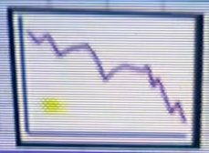{width="100}
{width="100}

### Still chess 
{width="100}

At 6:40, the chess pieces don’t bounce or move about, but still rotate to face the player. Adam says “sorry, uh, I’m not very good at talking while playing… so… I’ll put in a VO afterwards.” There also isn’t any music playing in the level.

### The Stairs Appear 
{width="100}

At 6:56, the first appearance of the infamous stairs occurs. They aren’t seen until Mr. Crow walks under an arch. The blocks next to the stairs are the only instances of letter blocks partially embedded in the ground.

### Second Meeting with Father Crow
{width="100}

At 7:09, Mr. Crow wall jumps up to a platform not visible from the start. The camera pans past the boat with no remark from Adam. The letter blocks making up the floor have noticeable z-fighting where they meet with each other. Mr. Crow then sights Father Crow in the center of some bouncy pawns beaming numbers to a computer Father Crow is typing on. All are surrounded by a red [catanic](#sir-cat) circle, on the ground. When he interacts with him, he responds with the first Crow Language code, and the game hangs.

### Vigenère Cipher#1
At 7:27 in the video, the following numbers are seen on the monitor, being typed repeatedly by another crow. 5863010175329940. The same numbers can also be seen on the floor, being beamed from the pawns towards Father Crow. Here are the decoded variants:<br></br>
    Nils ➡ Please remember me <br></br>
    Thea ➡ This is for another <br></br>
    Crow ➡ Message not for you <br></br>
{width="100}

### Crow Language #1
At 7:37 in the video the text **HWQHTROEE** shows up, after translating from Crow we get “I am in hell.”

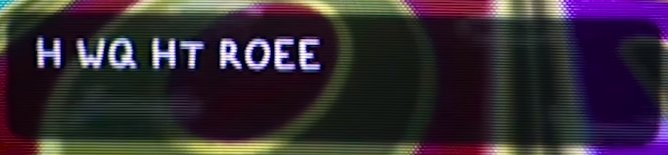{width="250"}
{width="250"}

### Grounds Again 

At 7:50, after a brief flash to the Clock Monster at Home, Mr. Crow reappears in the Grounds as a short jingle plays. The first sighting of Scarecrow occurs, but he disappears as Mr. Crow approaches. After this disappearance, Father Crow appears and enters the Work Building.

### Entering Work Again

At 8:16 when the Work Building is entered, notably lacking the circle cut transition, the framed image of that building that was in the lobby previously and the ambiance is missing. 

Mr. Crow goes the same way as he did previously, but the computer portal is also missing. The tile textures on the floor in that room are misaligned. At 8:30, the camera briefly cuts to a ringing phone in Manfred’s office, which is lacking a computer and family photo. Mr. Crow jumps on the phone to no visible effect. At 9:08, as he returns to the lobby, Father Crow is seen moving through the wall, and Mr. Crow follows him at moves out of bounds. The jump and wall jump sounds disappear.

{width="250"}
{width="250"}

### Father Crow Drowns
{width="250"}
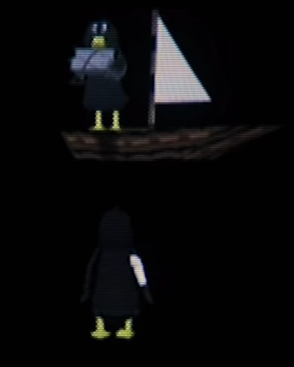{width="250"}

At 9:40, we see this scene of Father Crow carrying some computer equipment and jumping off a boat. Mr. Crow follows shortly behind, ending up in the forest area.zz

### Misaligned Stairs
{width="250"}

The stairs that appear at 10:30 do not match their environment, clip into the terrain, and the final step goes above the level they’re going to. These are the same stairs that appear at 12:00 in Home.

### Mr. Crow Falls Down the Stairs

At 10:40, Father Crow is weeping over an open grave, with a tombstone with the name “CROW”. The player attempts to jump into the grave, but fails. A phone rings, Mr. Crow moves a little forward, and the game glitches out as he falls down the stairs. At 11:07, the textures briefly change to brain scans before Mr. Crow falls down the stairs. Two creatures approach before the screen cuts to black.

!!! danger " "
	This is used as the strongest evidence that whoever Mr. Crow represents was injured or killed falling down the stairs. Perhaps a ringing phone had something to do with this incident, which is why it’s a recurring element.

{width="250"}

### Glitched hub
{width="250"}

At 11:27, Father Crow appears in the Grounds, now as the player character. The textures are corrupted (e.g., teddy bear textures on the road) and a distorted version of the Kid World’s music plays. The flower patches are z-fighting with themselves, the archways textures the CROW gravestone, and the bushes’ texture is replaced with a skull face.

### Off the hook
{width="250"}

At 11:59, the phone’s receiver is off the hook. There’s a light buzzing during the cutaways to Home

!!! danger " "
	 reminiscent of a phone off the hook, suggesting that this detail is important.

### Child's Room
{width="250"}
{width="250"}
{width="250"}
{width="250"}
{width="250"}
{width="250"}

At 12:40, multiple drawings can be seen on the wall as Father Crow approaches Dead Crow. The drawings are, clockwise starting from furthest right:

    Two adults and two children. The Lorenz Family.The fourth individual has an oddly white face.
    The drawing that inspired Catastrophe Crow.

    A doctor, Mr. Crow, and an MRI machine.Mr. Crow is being struck by lightning. Possibly says “Alter (age) 7.”
    Mr. Crow in a wheelchair getting struck by lightning.
    Mr. Crow is carried on a stretcher by two individuals.
On the floor is a toy boat, chessboard, a teddy bear, and letter blocks, just like in the Kid World.

After the camera pans to Dead Crow, the room begins to flood.

!!! danger " "
	This room likely belongs to either Thea or Nils.
## Catastrophe Crow N64

### House and Family
{width="200"}
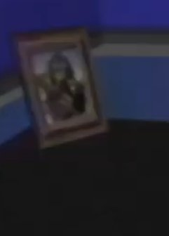{width="250"}

The house is framed on the wall. A family of four is framed on the desk. When Mr. Crow walks away from it, the photo transitions to Father and Mr. Crow alongside

!!! danger " "
	Perhaps this is the Lorenz family and this is a depiction of Manfred Lorenz’s office? Scarecrow and Crawler, suggesting that those creatures represent Marta and Nils.

### Morse Code Computer / Crow Language #2

This computer emits a repeating morse code which decodes to **LTOHQWXOQKAOEB**.

	._.. _ _ _ _ .... _ . ._ _ .. _ _ _ _ . . ._ _ _ _ . _... ._.. _ _ _ _ 

After translating from Crow Language, we get *“One I made myself.”*

{width="250"}
{width="250"}

### Dead End Hall
After encountering the computer, the hall changes so that it is dead ends with that computer at both ends.

## Video

### Father Crow Jumps
{width="200"}
{width="250"}
{width="250"}
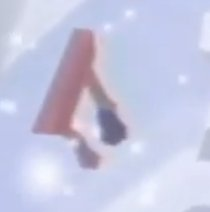{width="250"}
{width="250"}
{width="250"}

Mr. Crow runs up the arch and jumps into Father Crow, who is mirroring the former’s movement. Doing this, Mr. Crow is teleported above multiple otherwise unseen levels and falls through them. The first is a lava level, the second a snow level, the third a test level, before finally landing in a cave. A Monk can be seen moving through the torii arch in the snow level.

### Embedded Props
From 1:00 onwards, the player passes a number of props embedded in the walls of the cavern, and an image of a daytime sky briefly appears thrice. Reviewing the Unity file the objects are, in order:

- Roof, walls and window of upper part of the yellow house
- Roof and part of the walls of a corner of the yellow house
- Tipped over vase on an end table
- Hutch/buffet with a blue bowl on top.
- Bookcase
- Grandfather clock
- A pink armchair
- A phone and handset.
- End table
- Wooden high back chair
- Hutch/buffet
- Door

!!! danger " "
	This is roughly the same order of objects passed at Home at the end of WHAT HAPPENED TO CROW 64?

### Keyboard sounds #1 / Crow Language #3
From 1:17 onwards, the player collects what looks like letter/number block collectibles, contrasting to the silver coins seen elsewhere. Each of them makes a specific noise. These match the [Keyboard sound cipher](#keyboard-sound-cipher). 

After mapping the sounds to letters, we get **CRHAHALTEKBLIKLGIEHCCEOVILCROITLS**. 

Translating that from Crow, we get *“This is only for your little brother now.”*

### Four crows

{width="250"}

Within the cavern, three crows are briefly encountered. Two of them are larger than Mr. Crow, and one of them is the same size or smaller. **Perhaps the Lorenz Family?**However, Mr. Crow moves away from them, preventing a closer look. Below is the same scene from the rom.

{width="250"}

## Catastrophe Crow! – Underground Level

This video is the origin of the [Keyboard sound cipher](#keyboard-sound-cipher). This video has VHS distortion.

!!! danger " "
	suggesting that it is one of the oldest videos on the playlist.

### Crow Language #4

From 0:49 onwards the player steps on various keys on a computer keyboard, some of them lighting up with a green color. All the green inputs produce **UEOWAOBLIZHJOQOVLCRLBKLG**. After translating from Crow, we get *“Please forgive me, both of you.”*

Once the first correct letter of the Crow text is typed (U) a 10 minute timer starts, its purpose is unknown.

!!! danger " "
	A possible explanation is that this is a timer to solve the puzzle, and the intended audience was Thea, who was injured, and the long timer was to accommodate that.

	The computer resembles the one used to access the Kid World.


## catastrophe crow n64 playthrough
*This video is the origin of [“Crow Language"](#crow-language)*

### Crow Language #5

At 0:53 in the video, the [Graph board](#graph-board) can be seen -- various letters are now in place of the graph. The sticky note position here matches the downwards trend graph from the original video. 

If we overlay the graph on top of the letters, the text **HIWTWTXTLS** is revealed. Translating from Crow, we get *“I ran and now.”*

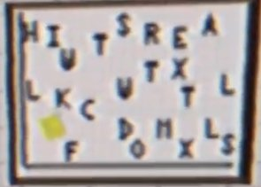{width="250"}
{width="250"}

### Dancing Chess
{width="250"}

In contrast to WHAT HAPPENED TO CROW 64?, the chess pieces here are moving around the board, and can injure Mr. Crow. The pieces move as they would in chess.

### Drop Down
{width="250"}
{width="250"}

At 1:45, Mr. Crow ledge crawls over to a path hidden under the Kid World. Upon entering the building on the path, he is taken to a dark area. Opening the pause menu reveals that it has been translated to Crow. 

There is a large object, perhaps a teddy bear,but it cannot be seen fully.This was used to help decipher Crow Language by the players.

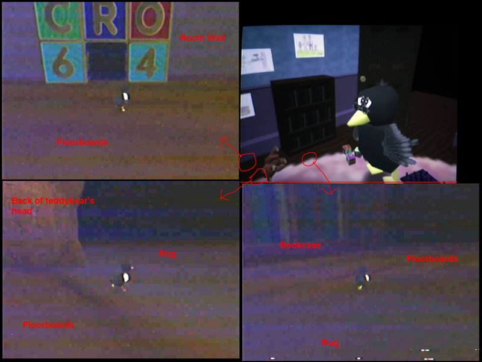{width="250"}
{width="250"}

!!! danger " "
	This area might be a darkened version of the bedroom.

## cc64 menu

This video has VHS distortion.

!!! danger " "
	 suggesting that it is one of the oldest videos on the playlist.

### Home is Missing

{width="250"}
!!! info inline end "Missing Home"
	Mr. Crow turns around, but Home is missing.

### Controller cipher / Crow Language #6
The focus of this video is a Controller Test screen. If we closely follow the inputs being made on the controller, a message encoded in Crow language can be found: 
**HSWACLLWBIWHX**, which translates to *“I was too afraid.”*

{width="250"}

Text on image says: TESTING >BACK

To piece together the original message, interpret controller usage as follows:

- Analog stick ➡ Follow the motions, they draw a letter
- Start button ➡ S
- A/B buttons ➡ A/B
- Analog C buttons ➡ C
- Left shoulder button ➡ L

### Skull Headshot

{width="250"}

The sound that plays in the video was decoded to binary, then to base 64, and finally to an image of the face that appears on multiple of the creatures.

## Let's Play Catastrophe Crow! 64 – Ep1

### Jump Sounds Return
Jumping makes the same cartoonish sound as it did at the beginning of WHAT HAPPENED TO CROW 64?

### No Family Photo

At 0:34, the family photo on the desk is missing. It appears that the **player is aware that it should be there**.The chair swivels to follow Mr. Crow.

{width="250"}

### Crow Language #7

At 0:50 a message in Crow Language is shown after the player attempts to speak to an empty chair. 

It reads **HXIOWQOXLBKLGUEWKHTZCRHALTOXWK**.  Translation: *“I dreamed of you playing this one day.”*

{width="250"}

### Forest Level Portal
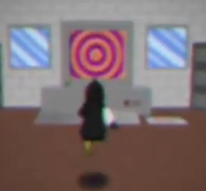{width="250"}

At 1:30, Mr. Crow jumps into a computer on the second floor, entering the Forest Level. Behind the computer is a painting. 

!!! danger " "
	Perhaps there’s portals to the Lava and Ice Levels on other floors? As there are five floors, this suggests there are five levels

{width="250"}

### Crow Language #8

At 1:58 the player walks across a bridge that is in the shape of various letters. The message is **VGCKLGTOJOISHEE**. Translated: *“But you never will.”* 

Collecting the silver coins here is silent. Slow drums play as background music. The bridge has a different texture than it head in the brief footage in WHAT HAPPENED TO CROW 64?

### Mirror Switch

{width="250"}
{width="250"}

At 2:58, when Mr. Crow interacts with the mirror, the Crawler briefly appears, the camera cuts away twice to the same area that Mr. Crow was when he fell down the stairs, and when control resumes Mr. Crow is replaced with Brother Crow.

### Father Crow's Message

{width="250"}

At 3:53 a crow with glasses tells the player that they loved to count and sing their name round and round. This is rather similar to how one would use the Vigenère Cipher, with numbers on the Y Axis and repeating letters of a person’s name for the X Axis.

!!! quote "Transcript of the entire message"
	…?

	You always looked alike…

	Of course I remember you

	You loved to count

	And sing your name

	Round and round

	Of course I remember you

	{width="250"}

## Let's Play Catastrophe Crow! 64 – Ep2

### Interface Oddities

There are jump sounds. When Mr. Crow goes near the vent at the back of Work, a B button prompt shows up, the only of its kind to appear. When he falls, he is respawned with no health.

### Crow Language #9

At 1:44 the player speaks to a teddy bear (which always faces the player strangely enough). The message box looks like pure noise but after fiddling with an image editor, a Crow language message can be revealed. 

It reads **HWQALIIKHNLGEXTLCVOSHCRKLGHTCROOTX** Translated: *“I am sorry I could not be with you in the end.”*

### Ankh Binary

{width="250"}
{width="250"}

At 1:44, the odd audio that plays is actually binary code, decoding to a five by seven pixel image of an ankh.

## Catastrophe Crow!: N64 Gameplay

This video has VHS distortion.

!!! danger " "
	suggesting that it is one of the oldest videos on the playlist.

### Musical Distortion
The music slows down and distorts as time goes on. In addition, there’s an odd percussion/tapping sound at 0:33 and 1:00.

### Dancing Chess
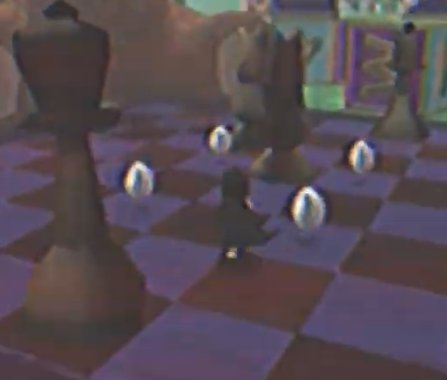{width="250"}
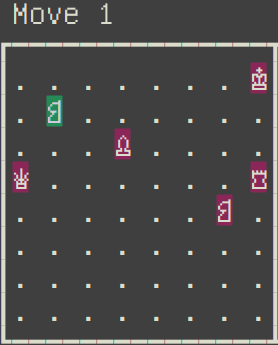{width="250"}

In contrast to WHAT HAPPENED TO CROW 64?, the chess pieces here are moving around the board, and can injure Mr. Crow. Their moves are shown above on the right, and a static version of that image’s frames can be found by clicking [here](https://web.archive.org/web/20220321132413/https://cdn.discordapp.com/attachments/766502962276466718/774066245922062346/cc64_chess-static.png)

{width="250"}

### Boat in the Distance

At 1:08, Mr. Crow spots a boat collectible in the distance. He walks across an invisible path towards it as the music fades to blowing wind. After collecting it, the camera turns around to reveal a Crow Language message.

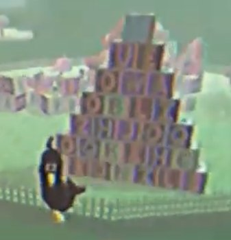{width="250"}

### Crow Language #10

At 1:40 a Crow Language message is in the letter blocks saying UEOWAOBLIZHJOQOQKEHCCEONILS, translating to “Please forgive me my little crow.”

{width="250"}

!!! warning " "
	Note that “Thea” is “Crow” in Crow Language, “Crow” is “Nils” in Crow Language, and “Nils” is “Thea.”

### No home

At 2:03 Mr. Crow turns around after being teleported above the Grounds. The house is missing.

## Forest Level

This video has VHS distortion.

!!! danger " "
	suggesting that it is one of the oldest videos on the playlist.

In contrast to Let’s Play Catastrophe Crow! Ep. 1, the silver coins have their usual jingle when collected.

{width="250"}
{width="250"}

### The Bandage Disappears 

At 1:00, after encountering Crawler, Mr. Crow is replaced with Brother Crow.

### Cartridge Tombstone

At 2:04, Brother Crow comes across the grave, which has been filled in and lacks a tombstone. Over it floats a cartridge or tombstonecollectible, which Brother Crow collects. After doing so, he is transported back to the Grounds.

### Doffice
At 2:18, when Brother Crow returns to Work, the lights have dimmed. The phone rings, but Brother Crow ignores it.

{width="250"}

### Crow Flies High

At 3:14, Brother Crow flies to the top of the work tower, finding a key collectible at the top. A droning sound plays in the background. When he collects the key, the Vigenère Cipher key appears.

{width="250"}

{width="250"}

### Sky pyramid
{width="250"}

At 3:50, when Brother Crow looks up at the skybox, it is noticeably pyramidal.

!!! danger " "
	it appears that the Grounds is inside a pyramid, and the gate actually leads outside of it.

### Crow Flies away

{width="250"}

{width="250"}

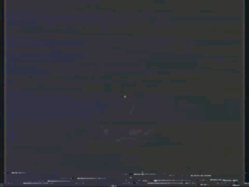{width="250"}

At 4:00, Brother Crow flies over the hills bounding the Grounds and lands on the skybox. In the distance there’s a gate which he goes through, entering a dark area. 

This area resembles the Sci-Fi Pyramid area shown at 1:28 in WHAT HAPPENED TO CROW 64? Instead of the typical circle cut transition, it is instead an inverted pentagon.

### Its Manfred 

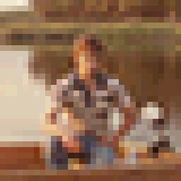{width="250"}

The sound playing in the Pyramid decodes to a bitmap image of Manfred Lorenz on his yacht.

### Small Drawing 
{width="250"}
{width="250"}

This appears briefly at 4:53, and decodes to the original Catastrophe Crow drawing, as seen on the left above.

## End Credits Soundtrack (1995)

{width="4000"}

!!! tip "Ocean Quest"
	This is, so far, the only video relating to Ocean Quest found.

### Thanks for Playing

Using the above key from the first 26 tones in the video, the odd tones in this video decode to “Thea Nils Marta Manfred thanks for playing.” Click [here](https://www.youtube.com/watch?v=mPcVKbuWmPg) for a video explanation of the process, courtesy of Johnathan Rose-Lyon.

## _ (Oct 29)
!!! tip " "
	This video’s title is simply an underscore, and a date is used here to disambiguate it.

### Still Image

{width="250"}
{width="250"}

This video is a still image of the forest level, shown above on the left with a cleaned up edited image above on the right. 

A crow, the Unbandaged Crow judging by the lack of cast, can be seen in the distance, lightly obscured by the fog and facing away. The well can also be seen.

!!! danger " "
	It’s possible that a yet-to-be deciphered Ocean Quest Cipher code is hiding in this video’s audio.


## _ (Nov 4)

!!! tip " "
	This video’s title is simply an underscore, and a date is used here to disambiguate it.

### Darkening Image
{width="250"}
{width="250"}

*Left: a still frame. Right: that frame brightened.*

The video consists of a still image, with darkness moving from the background into the foreground, until nothing can be seen. A crow, <span style="color:red"> possibly Brother Crow but it is difficult to discern if there is a bandage or not </span>,looks at the camera while in the forest level.

The audio is ambient crickets with faint tones translating to *“I remain.”*

## “Catastrophe Crow!” Development Documents

!!! tip " "
	The first video to be posted on a channel outside the original ones.

### Development Documents
{width="250"}
{width="250"}
{width="250"}

Images taken from the [tweet](https://twitter.com/AdermanUlrich/status/1328001736485838849) made by Aderman on the same day, which are the same as the ones used in the video. View that tweet for larger versions.

{width="250"}

- Document dated to March 2001, the month that Opus staff were laid off.
- Not all pages are given.
- Some German text, “Manfred, liest du das?” appears on the first given scan, translating to “Manfred, are you reading this?”
- Tree depicted with an eye.
- The first appearance of what was nicknamed by the community “Nightmarish Monster” up close, with its name given as “Monk.”
- What was nicknamed by the community “Skull Fish” is depicted up close, with its name given as “Flying Fish.”
- The building appears to be binary.
- A typo can be found in the line “Forest irregular geometry” with three letter rs. 

## ° (Nov 23)
{width="250"}
{width="250"}

### Night Archway

A binary code is played through sound after the “speech” sound effect plays, decoding to a seven by five pixel image of a key, as shown on the right.

This video shows actual gameplay, with Father Crow walking up the archway in the Grounds. On the other side is a teddy bear, which appears in a transformation starting with Mr. Crow, changing to Brother Crow, before settling on the Teddy Bear and below street lights can be seen. In the background is a dark cityscape not seen in the other videos. A frame before cutting to black, the Teddy Bear is replaced by a pawn.

The video’s tags are: "all", "live", "on", "things", "somehow". These tags are in the same order they were found in.

## ° (Dec 5)

### Teddy bear Binary

!!! note "Unity Key Crack"
	This video dropped AFTER the community cracked the Unity dump.

The video begins with Father Crow standing on the left side of the archway. Several seconds pass, and then the Teddy Bear appears, with the DIALOGUE START sound playing. A static code is then heard, which translates to 5x7 images of a pyramid and an ankh. Teddy Bear seems to float forward, and Father Crow leaps off the archway, meeting Teddy Bear in the air. The screen cuts to black.

### Ascend

Father Crow is seen then rocketing upwards, through several stages of the game. An increasingly high-pitched sound plays while he does this, perhaps bits of ERS START. As he exits a final pyramid shaped texture, and enters a white void, ERS START is heard, though in a glitched manner. Father Crow then disappears, leaving the white void present until the video ends.

The tags on this video are, in order: “and","feared","have","leap","long","so","the","you". 

This, combined with the video prior, when rearranged, seems to spell out: "All things must live on somehow, and so long you have feared the leap". We have been given this message in email, by ML.

!!! danger " "
	With the tags given to us, the ERS START sound playing, and the model of Father Crow ‘ascending’, then disappearing, this video could signify Manfred exiting the game, alive, with the intention to locate Nils and take him into the game. Player interaction, represented by the Teddy Bear, could have freed him, and ERS START is what is played when the Eternal Revival System kicks in.


## “Catastrophe Crow!” Development Documents 2

!!! tip " "
	A video version of a tweet posted by Ulrich Aderman

### Development Documents 2
{width="250"}
{width="250"}
{width="250"}
{width="250"}
{width="250"}
{width="250"}


[Posts from @AdermanUlrich on November 29th](https://twitter.com/AdermanUlrich/status/1333087360016379904?s=19), follow the link for the full version of each image. On the same day a video was posted to Aderman’s channel. Third maze shown on page 04 was used in Let’s Play Catastrophe Crow! Ep2. 


The letters are in alphabetical order, meaning thatmore likely than not there is nothing coded within them.Diagram on page 44c, “1-bit Image Compression Algorithm,” is a clue to using the binary audio cipher, which interprets binary audio as 1-bit information. Power Coins TBC on page 27 indicates that they have not been added, and the already seen coins are actually Silver Coins.

{width="250"}

The text on the other size of page 27 can be partially seen, revealing a partial moveset for Mr. Crow. 

The text is as follows:

!!! quote "Page 27"
	Current Move Set

	Walk/Run

	Jump (Triple jump inconsistent?)

	Context Sensitive B

	Wall kick/wall jump

	Ledge hang/ledge climb (too slow!)

	Mid-air jump/Flight (on some versions only)

	[Floor slide/equivalent move not implemented]

	Testing Access

	Now Requires 2 Keywords + BuildNo.+ Node

	e.g. ABCD123456789abABCD

The codes currently being tested are “THEA334007424unNILS” and “THEA330556211unNILS,” the numbers being from the building binary, “un” coming from the Work Vent path number, and “THEA” and “NILS” being two of the keywords.

{width="250"}

A map of the levels of the game is located on page 01! The levels appear to be as follows, from left to right, top to bottom:
{width="250"}

- ?
- Forest Level
- Work Second Floor
- Moon Level (?)
- Work Vent
- Work First Floor
- Toy World
- Night Grounds
- Grounds
- Underground Level
- Lava Level
- Ice Level
- Test Level (?)
- Tunnel Level (?)

On the opposite side of the page is a large image of the well in the Forest Level. The header says “Well Design.”

## Other Videos
Multiple channels have non-Catastrophe Crow related videos. So far nothing of note has been found in them.

!!! question "List of Videos"
	**Alpha Waves Continuum 4 Color CGA Graphics First Playthrough(3D Platformers NZ)**

	Alpha Waves is the first 3D platformer, and was released on the Atari ST, Amiga, and for DOS. According to Manfred’s Wikipedia, he did uncredited work on it. This video is of that game.

	**Tonic Trouble – N64 Difficult Lava Level(Childhood Memories 64)**

	Tonic Trouble is an early 3D platformer released on the Nintendo 64 and Playstation. The video features the player traversing a lava level. Tonic Trouble had a troubled development and was delayed multiple times.
	
	**Chameleon twist 2 level 1 (N64 Long Lost Lore)**

	Chameleon Twist 2 is an early 3D platformer released on the Nintendo 64. The video features the player starting a game, skipping the intro cutscene, and then playing through part of the first stage of the game. The video cuts off before the stage is completed.
	
	**Let's Play Doraemon 64 – First Boss(90sRetroGamingFRed)**

	Doraemon is a popular Japanese franchise centering around the eponymous robot cat and his gadget-based antics, and Doraemon 64 is a game based on this franchise released on the Nintendo 64. The video is gameplay entirely within Japanese, as the game did not see an international release.

	**Gex 64: Toon Land (N64ExcavationMan)**

	Gex 64 is the Nintendo 64 version of the sequel to the original Gex platformer. Gex is a gecko who was sucked into the TV, and has many adventures. The video is footage of the cartoon themed world.
	
	**Rocket Robot On Wheels Opening Gameplay (Ultra 64 Forever)**

	Rocket: Robot on Wheels is an early 3D platformer on the Nintendo 64 involving a robot going on an adventure to save his circus.


## Channel Findings

### Multiple Channels
{width="250"}

### Manfred fusion

By joining parts of the channel names, one gets Manfred Lorenz’s name.

- N64 Excavation **Man**
- 90s Retro Gaming **FRed**
- N64 Long Lost **Lore**
- 3D Platformers **NZ**

Childhood Memories 64 and Ultra 64 Forever are notably absent from this, <span style="color:red"> although the findings on those channels suggests they are also connected to Manfred. </span>

## Childhood Memories 64

### Remember This Cheat?

The channel description contains this: “Remember this cheat code?: 7689-422697-89-60951”. 

When put through the Vigenère Cipher using NILS, the result is “Join-Emails-In-Order”. This hint was used to find M L’s email.

## Ultra 64 Forever

{width="250"}

In the channel description, there is a string of base-64 text that decodes to a 16x16 photo, the same seen on the desk in Catastrophe Crow N64. The base-64 is below.

```
	Qk04AgAAAAAAADYAAAAoAAAAEAAAABAAAAABABAAAAAAAAICAAAlFgAAJRYAAAAAAAAAAAAAYhCEEIQQhBCEEIQQhBCEEIQQhBCEEIQQhBCEEIQQhBCFEGEMYxCEEIQQhBCEDIQQhBCEEIQQhBCEEIQQhBCEEDIZyxRjDGEMgxCEEIQQYwxjCGMMhBCEEIQQhBCEEIQQFBE1GREZqRBiDGIM5yDGIKUYpRiEEGMMgxCDEIMQYxCRKTIZFBU1Ge8UhxAHKUg1SDEGKeYkxBhiDGMQgxCEEIo1rjVxKTIZFhHwFEYxTFrOUYxBRzULHe8Q7xQPGRAVxRgnJYoxrjFzJewYqD2oRUtBdWKKPe0UNhUzGTMZMxmLEKcUxBgmJWoxKilINcUohBysRUgxDxkTFREZERkRGXMIcQiNDIgQhRAoJQcppCClICctKS0SFRMREhUSFRIVcghzDHQMcwhOCAcljDEJJUoxzjlKLXElcSVwJXAlcCWSDHIIkwyVCHEMJjGKOUotKSkqLSctqjWqOak1qTWpNXIIcgiTDHQIjwznIAcpJy1HLUUx6CCsFOwYzBjMGM0YcgiSDJIMkgySDHIIcAhvCI8MrBCRDHgImQyYDJkImAhUBDQANABUBFMEcwRzCHQIdAh0BHMIuAy5DLgMuAy4DJIxcikzIfMYsxCTDHMIUwQzADMAMwBYBFkEWARYBFgEcVKRUnBOUUoxRhFC0TmyMXIpMiEUHTkhOCE4ITghVyUAAA==
```

### Twitter Account
There is a twitter account associated with this channel, [@64Childhood](https://twitter.com/64Childhood).His tweets consist of links to Youtube videos related to Catastrophe Crow, including ones not published by Ultra 64 Forever. 

As of now, no other twitter accounts have been discovered and no responses have been received from this account.

### Banner 

There is faint text on the channel banner, but this is because it is an issue with scanning. It is present in the original scan from the magazine.

{width="250"}
{width="250"}

## Twitter Findings

### Profile Picture
A
derman’s profile picture comes from [this](https://commons.wikimedia.org/wiki/File:SGI_Octane_Graphics_Board.jpg), an image of a SGI Octane’s graphics board.

### Catastrophe Crow Documents

[Post from @AdermanUlrich on November 15th](https://twitter.com/AdermanUlrich/status/1328001736485838849) saying: 
!!! quote " "
	“After renewed interest in "Catastrophe Crow!", I found several documents from my Opus days. Maybe some of you find them interesting.” Images were attached, as can be seen and discussed [here](#development-documents), since they were identical to the contents of a video from Aderman.


### Development Hardware

{width="250"}
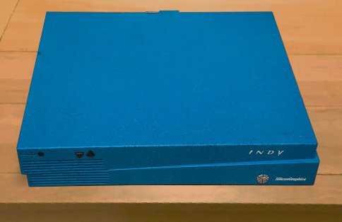{width="250"}

[Post from @AdermanUlrich on November 19th](https://twitter.com/AdermanUlrich/status/1329347633853370369) saying: “I have also retrieved this from storage. Unfortunately not powering on, I suspect several components need replacing. Keep you posted.”

{width="250"}

The workstation pictured is an SGI Indy, a low-end system from Silicon Graphics, sold between 1993 and 1997. Although “low-end”, its specifications exceed that of the Nintendo 64.

On the same day, Ulrich responded to one of the researchers giving advice on how to fix the SGI Indy.

The images posted are edited pre-existing images, found [here](https://commons.wikimedia.org/wiki/File:SGI_indy_front.jpg) and [here](http://sgistuff.net/hardware/systems/images/challenges-1400-back.jpg).

### Rom Drop

Aderman posted a [download of files found on the workstation](https://twitter.com/AdermanUlrich/status/1335265734004514817). Included was an incredible amount of information and a non-functional rom file. Included are the following:

- A .rom file, or rather a password protected archive.
- Audio assets
- Image assets
	- The letter blocks for “HOME” are commented
- Screenshots, including ones from the scans

### Catastrophe Crow Sounds

Upon being given the password, Aderman then released a [‘soundtrack’ of sorts on archive.org](https://archive.org/details/catastrophe-crow). Included were the following:

- The main theme, two versions
- Individual instruments in the main theme
- Ambiance sounds
- Sound effects

Two of these are of note. DIALOGUE MOTHERCROW is the sound that plays at the beginning of Crow gameplay in WHAT HAPPENED TO CROW 64? This absolutely confirms that it is Marta saying ‘He hasn’t been home’.

ERS START can be inferred to mean ‘Eternal Revival System Start’. This sound may play when ERS activates. This plays in a few spots, including several times in WHAT HAPPENED? and once, in a glitched state, in the video that was released on December 5th.

## Game Findings

Find the dedicated sub-document for the Workstation Dump [here](https://web.archive.org/web/20210319135021/https://docs.google.com/document/d/1UmgjgyoUtr3vjUP9fjZNJN698BeQcgafdg8CadVAfEw/edit).


## MISC Findings

### The Slain Crow
“Thea”, “Nils”, and “Crow”, the valid names for the Vigenère Cipher, are an anagram for “The Slain Crow”.

### Phone Buzz Binary
On four different occasions, there has been a clicking/whirring noise, <span style="color:red"> possibly an encoded message </span>, all playing when something unusual occurs.

- WHAT HAPPENED TO CROW 64? at 9:50 when Father Crow jumps off the boat.
- WHAT HAPPENED TO CROW 64? at 11:07 when Mr. Crow falls down the stairs.
- Catastrophe Crow! - Underground Level at 2:10 when Mr. Crow solves the puzzle.
- Let’s Play Catastrophe Crow! 64 - Ep1 at 2:57 when Mr. Crow interacts with the mirror.

### Borrowed Textures

Many of the textures in Catastrophe Crow are taken from Super Mario 64, some of them lightly edited. It is unknown if this was done for the sake of convenience for Adam and team, or if Opus Interactive in-universe took the textures.

### Ocean Quest Boat

There is a boat model made by Westerly named [Oceanquest 35](https://www.yachtworld.com/boats-for-sale/make-westerly/model-oceanquest-35/). 

It is unknown if this has a connection to the game.

### Thumbnail oddity

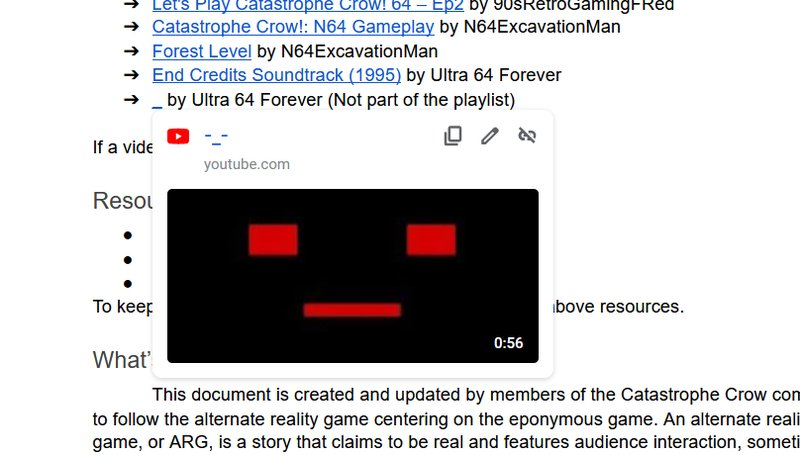{width="250"}

{width="250"}

The links on [Google Docs](https://misaelk.github.io/crow64-doc/) for both _ videos have displayed an unusual behavior where their thumbnail and occasionally time listed differ from the actual video. This is not deliberate and is instead an unpredictable bug where the incorrect video is used for the embed, and multiple completely unrelated videos from things like a popular phone game or an Iranian musician have gotten their thumbnail displayed. Pictured above is an example of how it appears. The link otherwise works as intended.

### Merchandise Store
	
There is an [official merchandise store](https://www.google.com/url?q=https://teespring.com/stores/catastrophe-crow-official&sa=D&source=editors&ust=1617910462106000&usg=AOvVaw1UuNnCxQnYjUspA5X-h57l) .So far nothing of note, aside from cool merchandise that you definitely should buy, has been gained from it.

### The User who Messaged Inside a Mind

As mentioned in Inside a Mind’s [video on Catastrophe Crow](https://www.youtube.com/watch?v=XYZolVGULg8), he learned of the game through a Reddit user messaging him claiming to be a beta tester. That user has since been identified, and based on their other posts meant as a beta tester for the ARG, not the fictional game. They have not replied to messages or made any posts since the start of the ARG.

## Scan Transcriptions
!!! note " "
	Footnotes have been added with various observations, listed underneath each transcription separated with a horizontal bar.

### Planet 64 (1:05 in WHAT HAPPENED TO CROW 64?)
{width="250"}

!!! quote "Stone the Crows!"
	A surprise addition to the main presentation at Spaceworld was Catastrophe Crow, a game bearing more than a passing resemblance to Rare’s own animal-related newie, Banjo-Kazooie.Its playing set-up will be comfortably familiar to most Mario-followers, with the eponymous ‘Crow legging it around lushly-created 3D worlds and jumping on badguys’ heads.¹

	The demo showed off all kinds of fluid moves from wall-jumps to hanging-off-ledges, but we suspect we’ll never fly until we get that bandage off our wing…

	The slightly-hard-to-read Press Release promised ‘fearless exploration of unfamiliar worlds’² and detailed a surreal plot about trying to save your father’s business from a corporate takeover by the sinister Sir Cat.

	The company skyscraper appears to form a Peach’s-Castle-style hub from which you access a range of unique-looking worlds, from a misty forest to a land of giant toys to some kind of mysterious Ancient Egyptian Spaceship thing-y. And while the format currently screams ‘SM64-clone’ the developers have promised something called an ‘eternal revival system’ to keep things changing every time you play.

	This will be the first N64-outing from Opus Interactive, a German developer helmed by director Manfred Lorenz, whose action-adventure Ocean Questwas a surprise late hit for the SNES.

	With an unconfirmed release date set not for another two years, we expect more information to come through rather slowly on this one. But considering Opus Interactive’s lasting reputation for great gameplay and impressive world-building, we at N64can’t wait to actually get our thumbs on it

	{width="250"}

	Mr Crow sure looks cute, even as he navigates a somewhat creepy block world. Is that a teddy bear looming in the mist?⁴

	{width="250"}

	Loads to explore, but I wouldn’t trust those berries

	{width="250"}

	Flap! Woosh! With the help of some triple jump acroba-tics, going to work looks kinda fun!

	{width="250"}

	Scary monsters in the forest. Nightmarish!⁵

	{width="250"}

	Almost as strangely laid-out as our office…

    Those chess enemies move according to chess rules. Nice!

	{width="250"}


	¹ No goomba-stomps have been seen in any of the videos.

	² British styled quotes. This scan was probably originally published in Britain.

	³ This surreal plot hasn’t been seen in video yet, and neither has Sir Cat. In addition, the parallels to Opus’s own troubles can’t be overlooked.

	⁴ Notice the carpet, different from the grass seen in the videos, and the fog.

	⁵ The door appears to be a modified version of the door used in Mario Party 2’s Horror Land Board.

### N64 Future Look (2:00 in WHAT HAPPENED TO CROW 64?)
{width="400"}

!!! quote "CATASTROPHE CROW!"
	We’ve had our beady N64 eye on Catastrophe Crow!For quite a few issues now. In development at Opus Interactive’s Hamburg base for something approaching three years, it’s a game that’s looked consistently amazing in every screenshot we’ve seen. When given the opportunity to play it for ourselves, we jumped at the chance.

	Visuals·The game brims with imagination and wonder, and, thanks to the expansion pak, is rendered in bright ultra-crisp detail.

	Based on a very strange storyline indeed, Catastrophe Crow!Consists of nine massive 3D worlds in desperate need of exploration. You play as the eponymous Crow, who runs head-first into their¹ father’s office to collect Power Coins and stop a corporate takeover by the evil Sir Cat.

	Much like Peach’s Castle in Super Mario 64, this tower block serves as a hub-world to get you to each exciting new level - jumping appropriately into computer screens to explore the levels within.

	And explore we did. Because Catastrophe Crow!Is absolutely brimming with imagination and wonder. We’ve clambered up giant teddy bears, sneaked around misty forests and hot-footed our way through a giant lava-powered machine. It’s truly giving Super Mario 64and Banjo-Kazooiea run for their money in terms of world design.

	Of course, where comparisons are also going to be made is to SM64’s move-set, which emphasises free-wheeling acrobatics over BK’s more complicated-and-sometimes-clunky moves. We’ve enjoyed flipping from triple-jumps to wall-jumps to hanging off ledges. If Crow’s wing wasn’t so adorably bandaged maybe we might even fly...perhaps an unlockable secret if we collect enough Power Coins.

	But while jumping on platforms and battling bizarre baddies is exceptionally fun, the few hours we’ve spent with the game have slowly revealed a surprisingly deep and puzzle-y extra layer. The more we;ve explored, the more we’ve got a sense of the game hiding something larger...cryptic clues in character dialog, a strange code found in forgotten corners of the levels, even a bizarre sci-fi pyramid filled with hieroglyphics.

	Manfred Lorenz - Catastrophe Crow!’s notoriously enigmatic director - has long-hinted he’s been making something perhaps more akin to Mystthan a kid-friendly platformer, remarking that “games are made of code, but they also are codes. There must be a gap, and a leap of faith between player and designer.”

	Perhaps he’s just being pretentious, or you’ll be unraveling this mystery with us when the game comes out this Christmas…

	{width="250"}

	The cogs and machines make this no cliché lava level.

	And where would we be without a cute snow world?

	Hop up high to get some great level-spanning vistas, with barely any fog or pop-up in sight!

	¹ “Crow” instead of “Mr. Crow” and a singular they.


### An audience with… Manfred Lorenz (1:38 in WHAT HAPPENED TO CROW 64?)
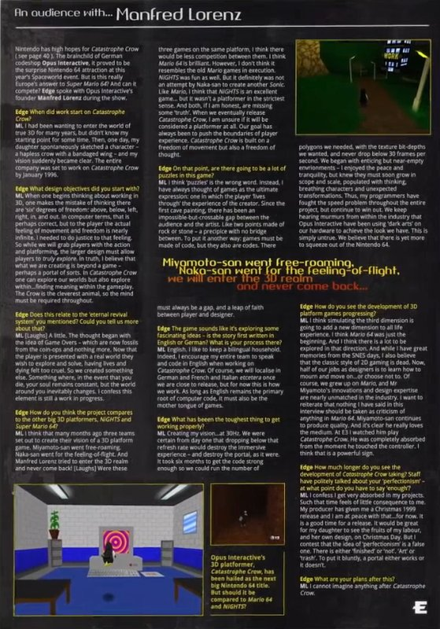{width="400"}

!!! quote "Interview Transcript"
	Nintendo has high hopes for Catastrophe Crow(see page 40). The brainchild of German codeshop Opus Interactive, it proved to be the surprise Nintendo 64 attraction at this year’s Spaceworld event. But is this really Europe’s answer to Super Mario 64? And can it compete? Edgespoke with Opus Interactive’s founder Manfred Lorenzduring the show.

	Edge: When did work start on Catastrophe Crow?

	ML: I had been wanting to enter the world of true 3D for many years, but didn’t know my starting point for some time. The, one day, my daughter spontaneously sketched a character - a hapless crow with a bandaged wing - and my vision suddenly became clear. The entire company was set to work on Catastrophe Crowby January 1996.

	Edge: What design objectives did you start with?

	ML: When one begins thinking about working in 3D, one makes the mistake of thinking there are ‘six’ degrees of freedom: above, below, left, right, in, and out. In computer terms, that is perhaps correct, but to the player the actual feeling of movement and freedom is nearly infinite. I needed to do justice to that feeling. So while we will grab the players with the action and playforming, the larger design must allow players to truly explore. In truth, I believe what we are creating beyond a game - perhaps a portal of sorts. In Catastrophe Crowone can explore our worlds but also explore within...finding meaning within the gameplay. The Crow is the cleverest animal, so the mind must be required throughout.

	Edge: Does this relate to the ‘eternal revival system’ you mentioned? Could you tell us more about that?

	ML: [Laughs] A little. The thought began with the idea of Game Overs - which are now fossils from the coin-ops and nothing more. Now that the player is presented with a real world they wish to explore and solve, having lives and dying felt too cruel. So we created something else. Something where, in the event you die, your soul remains constant, but the world around you inevitably changes. I confess this element is still a work in progress.

	Edge: How do you think the project compares to other big 3D platformers, NiGHTSand Super Mario 64?

	ML: I think that many months ago three teams set out to create their vision of a 3D platform game. Miyamoto-san went free-roaming, Naka-san¹ went for the feeling-of-flight. And Manfred Lorenz tried to enter the 3D realm and neve [sic] come [sic] back! [Laughs] Were these three games on the same platform, I think there would be less competition between them. I think Mario 64is brilliant. However, I don’t think it resembles the oldMariogames in execution. NiGHTSwas fun as well. But it definitely was not an attempt by Naka-san to create another Sonic. Like Mario, I think NiGHTSis an excellent game… but it wasn’t a platformer in the strictest sense. And both, if I am honest, are missing some ‘truth’. When we eventually release Catastrophe Crow, I am unsure if it will be considered a platformer at all. Our goal has always been to push the boundaries of player experience. Catastrophe Crowis built on a freedom of movement but also a freedom of thought.

	Edge: On that point, are there going to be a lot of puzzles in this game?

	ML: I think ‘puzzles’ is the wrong word. Instead, I have always thought of games as the ultimate expression: one in which the player ‘lives through’ the experiences of the creator.² Since the first cave painting, there has been an impossible-but-crossable gap between the audience and the artist. Like two points made of rock or stone - a precipice with no bridge between. To put it another way: games must be made of code, but they also are codes. There must always be a gap, and a leap of faith between player and designer.³

	Miyamoto-san went free-roaming

	Naka-san went for the feeling-of-flight,

	We will enter the 3D realm

	And never come back...⁴

	Edge: The game sounds like it’s exploring some fascinating ideas - is the story first written in English or German? What is your process there?

	ML: English, I like to keep a bilingual household. Indeed, I encourage my entire team to speak and code in English when working on Catastrophe Crow. Of course, we will localise in German and French and Italian etceteraonce we are close to release, but for now this is how we work. As long as English remains the primary root of computer code, it must also be the mother tongue of games.

	Edge: What has been the toughest thing to get working properly?

	ML: Creating my vision...at 30Hz.⁵ We were certain from day one that dropping below that refresh rate would destroy the immersive experience - and destroy the portal, as it were. It took six months to get the code strong enough so we could run the number of polygons we needed, with the texture bit-depths we wanted, and never drop below 30 frames per second. We began with enticing but near-empty environments - I enjoyed the peace and tranquility, but knew they must soon grow in scope and scale, populated with thinking, breathing characters⁶ and unexpected transformations. Thus, my programmers have fought the speed problem throughout the entire project, but continue to win out. We keep hearing murmurs from within the industry that Opus Interactive have been using ‘dark arts’⁷ on our hardware to achieve the look we have. This is simply untrue. We believe there is yet more to squeeze out of the Nintendo 64.

	Edge: How do you see the development of 3D platform games progressing?

	ML: I think simulating the third dimension is going to add a new dimension to all life experience [sic]. I think Mario 64was just the beginning. And I think there is a lot to be explored in that direction. And while I have great memories from the SNES days, I also believe that the classic style of 2D gaming is dead. Now, half of our jobs as designers is to learn how to mourn and move on...or choose not to.⁸ Of course, we grew up on Mario, and Mr. Miyamoto’s innovations and design expertise are nearly unmatched in the industry. I want to reiterate that nothing I have said in this interview should be taken as criticism of anything in Mario 64. Miyamoto-san continues to produce quality [sic]. And it’s clear he really loves the medium. At E3 I watched him play Catastrophe Crow. He was completely absorbed from the moment he touched the controller. I think that is a powerful sign.

	Edge: How much longer do you see the development of Catastrophe Crowtaking? Staff have politely talked about your ‘perfectionism’ - at what point do you have to say ‘enough’?

	ML: I confess I get very absorbed in my projects. Such that time feels of little consequence to me. My producer has given me a Christmas 1999 release and I am at peace with that...for now. It is a good time for a release. It would be great for my daughter to see the fruits of my labour, and her own design, on Christmas Day. But I contest that the idea of ‘perfectionism’ is a false one. There is either ‘finished’ or ‘not’. ‘Art’ or ‘trash’. To put it bluntly, the portal either works or it doesn’t.

	Edge: What are your plans after this?

	ML: I cannot imagine anything afterCatastrophe Crow.

	¹ Japanese honorifics. Strangely, Miyamoto is referred to as “Mr. Miyamoto” later in the interview, before switching back to “Miyamoto-san.”

	² A good indication that even before Manfred’s breakdown, the game was already somewhat of a reflection of his life.

	³ This was quoted in the N64 Future Look scan, indicating that this interview was made before that.

	⁴ Looks like Edge paraphrased Manfred a bit.I don’t think Edge really understood what Manfred was saying in this interview, considering how little follow-up questions they ask. You have a notoriously eccentric developer saying strange things and you don’t think to ask for clarifications?

	⁵ “30 Hz,” or 30 frames per second an unusual choice of wording since PAL is normally 50 Hz or 50 frames per second. However, actual frame rates on the N64 can vary wildly, sometimes struggling to hit 30 fps. The Nintendo 64’s CPU (93.75 Mhz) and graphics (62.5 Mhz) are greater. Awake Human brain waves are about 30 Hz, however, so perhaps he’s not referring to frame rate?

	⁶ “Thinking,” perhaps an indication of attempts to program complex AI?

	⁷Taking “dark arts” literally has been wonderful fodder for our theorists.

	⁸ Odd choice of words.Perhaps Thea had already died when this interview was made?However, that would contradict the later statement “It would be great for my daughter [to see the release] on Christmas Day.”


## Locations
!!! note " "
	None of these levels have been given official names so far, so nicknames are given here for convenience.

### Grounds

First seen at 2:00 in What Happened to CROW 64? and is prominent throughout the videos. 

The Grounds is a grassy valley with a path between a house (called “Home” in this document) and an office building labeled “Work”. Bushes, flowers, and butterflies are placed throughout, a prominent natural archway stands above the path between Home and Work, but the two parts of the arch do not meet. In Forest Level, the skybox changes to a pyramidal shape.

{width="400"}

### Work Building
An office building with large text saying “WORK” in front of it. In the back there is a vent leading to a secret puzzle area. On top is the key to the Vigenère Cipher. Inside are portals in the form of computers to the Toy and Forest Levels. It has five stories.

{width="400"}

In the interview, there’s a screenshot of the Grounds at night, with street lights leading up to the Work Building.

### Home (No sufficient info)

A house, apparently where Father and Mr. Crow live. Likely represents the Lorenz house.It appears and disappears multiple times throughout the videos, and hasn’t been explored in a “normal” state.

### Pyramid 

{width="400"}

{width="400"}

{width="400"}

{width="400"}

{width="400"}

{width="400"}

First seen briefly at 1:29 in WHAT HAPPENED TO CROW 64? and later much darker in Forest Level. Pyramids are notably tombs in real life. It has not been explored on video thoroughly yet. The hieroglyphs, “𓇳𓅃𓋹” (sun/N5-falcon/G5-ankh/S34) above the gate translate to “may Re live.” The other symbols may have some meaning as well.When it appears at the end of Forest Level and in the Workstation Dump, it has green highlights instead of pink.

- NewTotem_Boat appears to be blank at first glance, but is actually an image of a boat or basket, possibly the hieroglyph 𓎟 (basket/V30.)
- NewTotem_Cat looks a lot like a pentagram missing a line, but it has not been identified as of yet.
- NewTotem_Crow has what appears to be a halo.It does not match any hieroglyphs.
- NewTotem_Eye is the Eye of Horus (D10.)
- NewTotem_Water is similar to but different from the hieroglyphs 𓈖 and 𓈗 (ripple of water/N35 and three ripples of water/N35A), but appears closer to the Aquarius symbol (♒︎.)

### Kid World
{width="400"}

First seen at 2:00 in WHAT HAPPENED TO CROW 64? This level is grassy and decorated with gigantic toys, specifically letter blocks, a chess set, and a teddy bear. Jaunty music plays, but it gives way to blowing wind as Mr. Crow ventures away from the “normal” play area. A large platform of letter blocks is above it, but it cannot be seen from the ground.

Contains chess pieces as enemies. These pieces remain on the chessboard, guarding some silver coins.

The letter blocks change between visits, <span style="color:red"> possibly a subtle product of the Eternal Revival System. </span>

### Forest Level/Graveyard

{width="400"}

*Path taken in Let’s Play Catastrophe Crow! Ep. 1 and in WHAT HAPPEND TO CROW 64?*

*Bandage Crow refers to Mr. Crow and Small Crow refers to Brother Crow*


First seen at 2:09 in WHAT HAPPENED TO CROW 64?, and then multiple times after. Accessible on the second floor of the Work Building. Multiple notable events in the videos occur here, such as the stair-falling incident, suggesting that this forest has some importance to the Lorenzes and may represent a real location.The Forest Level is a forest with thick fog, and contains, among other things, a bridge area, a well, a grave, Crawler, and the same stairs that appear at Home.

In the screenshot included in the Planet 64 scan, Mr. Crow is standing in front of a large out-of-place door, which has not been seen yet on video. In addition, there are multiple indications (Planet 64 scan and 2:09 of WHAT HAPPENED TO CROW 64?) that Monks were present in the level at some point, but they have not been seen on video.

### Flying Fish Bridge

A bridge with Flying Fish jumping over. It appears at 2:09 in WHAT HAPPENED TO CROW 64 and again in Let’s Play Catastrophe Crow! 64 - Ep1. In its first appearance, the bridge is straight, but in the let’s play it is constructed of letters. <span style="color:red"> It’s possible that these are two different bridges, since the coast is closer and more parallel in the first appearance. </span>

### Mirror Hill & Well (No Sufficient info)
The mirror where the Crawler appears is elevated upon a hill and is near a well.

### Tunnel Level (No Sufficient info)

Accessed in Video after Mr. Crow falls through multiple other levels.

### Underground Level

Accessed in Catastrophe Crow! - Underground Level where it contains a large computer whose monitor opens up to reveal a large crow head upon solving a puzzle.

### Lava level
{width="400"}

First seen at 2:00 in WHAT HAPPENED TO CROW 64? and later briefly in Video. Contains moving gears. Was legitimately accessible in earlier versions, considering its appearance in the Planet64 scan, but has not been accessed during “normal” gameplay on video yet.


### Ice Leve
{width="400"}

First seen at 2:00 in WHAT HAPPENED TO CROW 64? and later briefly in Video. Inhabited by Monks. Was legitimately accessible in earlier versions, considering its appearance in the Planet64 scan, but has not been accessed during “normal” gameplay on video yet.

### Test Level (No Sufficient info)

Seen only briefly in Video. Appears to be the Super Mario 64 DS Test Level with modified textures and an additional ramp.

### Moon Level (No Sufficient info)
Thus far only seen in “Catastrophe Crow!” Development Documents 2 and its corresponding tweet. 

The model used to represent it in Development Documents 2 is called “Moon” in the Workstation Dump.

### Germany And Italy

{width="400"}

#### Cuxhaven

Where the Lorenzes lived during the public development of Catastrophe Crow. Cuxhaven is a small coast town in the north of Germany. It is a popular tourist destination and historically was a major fishing wharf for Hamburg. Important note:while the house used as the Lorenz house has been located, the actual real house is almost certainly not intended to play a role in the ARG. Please do not bother the people who live in it.

#### Hambug

Where the office of Opus Interactive was. Hamburg is a large historically, culturally, and financially significant city in northern Germany. Hamburg is one of three cities in Germany that are part of their own Bundesland (state).

#### Schwarzwald/Black Forest

A large forest in southern Germany, near the border with France. A candidate for the holiday location due to being the most notable of the German forests, but its size likely means that if the holiday location is here, it needs to be narrowed down further.This area is considered for the Lorenz holiday location due to being forested and having tourist attractions.

#### Bispingen & Wilseder Berg

The eBay auction listing for the development cartridge was as being in Bispingen. It is a small municipality known for being a popular vacation destination. It is about 52 kilometers (32 miles) south of Hamburg. It contains a nature reserve, the Wilseder Berg, which is populated by heather and more loosely by trees. 

#### Vallombrosa

Vallombrosa is a summer resort in Tuscany, Italy. It lies within a forest, and contains a nature reserve. It is a tourist destination. 

#### Laurentum

Important ancient but now unpopulated town in Lazio, Italy between Ostia and Antium (Anzio.) It was regarded as the original capital of the Latins. The Villa of Pliny the Younger is located in its former location. It’s the origin of the “Lorenz” family name. Unlikely to be the holiday location on account of no longer existing.

#### Helgoland & Wattensee Islands

Islands in the North Sea. Notably many are connected to ornithological (bird) study and conservation and two are tourist destinations. 

The Lorenz holiday destination is possibly Helgoland or Neuwerk, considering their proximity, tourist attraction, and connection to birds, and considering that the latter three islands are neither readily open to the public nor have facilities for a holiday, but are mentioned here for completeness.

- Helgoland (German) or Heligoland (English) is a pair of islands of historical and cultural significance. They lie 69 kilometers (43 miles) from Cuxhaven. It is both a vacation destination and an important location of ornithological study.
- Neuwerk is a small island 13 kilometers (8 miles) from Cuxhaven, and can be reached on foot during low tide, making it a popular tourist spot. It has a population of 32.
- Nigehörn/Nigehoern is a tiny island 15 kilometers (9 miles) from Cuxhaven. It has been a bird sanctuary since 1989, but public visits are prohibited starting at an unknown time.
- Scharhörn/Scharhoern is an even smaller island 15 kilometers (9 miles) from Cuxhaven. Public access is forbidden with the exception of tours. It serves as a bird sanctuary.
- Sylt (too far north to be on the map above) is an island off the western coast of Schleswig and is a jet ski tourist destination. It’s about 119 kilometers (74 miles) from Cuxhaven.
- Trischen is a small island about 22 kilometers (14 miles) from Cuxhaven. It is only populated from March to October by a bird warden as it is part of a national park. Many birds visit throughout the year

#### United States

The commonly used picture of Manfredis speculated to have been taken on the American Great Lakes or on a man made lake in the American Midwest or Florida, going by the trees in the photo and by the American-branded beer (Pabst) sitting near Manfred.

## Timeline

| Time       | Event                              |
| :---------- | :----------------------------------- |
| `1993, August 23`        | Project Reality, later becoming the Nintendo 64, announced  |
| `1995 (Unknown Date)`       | Ocean Quest Released |
| `1996 (Unknown Date)`    | Manfred Lorenz receives AIAS Hall of Fame Award, a real award whose first real life recipient was in 1998 |
| `1996, January`    | Crow 64 development begins |
| `1996, June 23`    | Nintendo 64 released in Japan |
| `1997, November 21-23`    | Spaceworld is held, Crow 64 announced |
| `1997 Q4`    |     Planet 64’s article on Crow 64 published/Unusual content already present |
| `1997, December 7`    | 1st Crow revision date |
| `1998, 1999`    | Copyright dates on title screen |
| `1998, January 11`    | 2nd Crow revision date |
| `1998, June 22`    | 3rd Crow revision date |
| `1998, July`    | An Audience with… Manfred Lorenz published |
| `Between 1998, July and 1999, Christmas Season`    | Crow 64 renamed to Catastrophe Crow! |
| `1998, November 19`    | 4th Crow revisiondate |
| `1999, February 6`    | 5th Crow revision date |
| `1999, March 7`    | 6th Crow revision date |
| `1999, May 13`    | QProject Dolphin, later becoming the Gamecube, announced |
| `1999, June 24`    | 7th Crow revision date |
| `1999, Christmas Season`    | N64 Future Look’s article on Catastrophe Crow published |
| `~`    | Original planned release date |
| `1999, November 5`    | 8th Crow revision date |
| `1999, November 22`    | 9th Crow revision date |
| `1999, December 18`    | 10th Crow revision date |
| `2000, January 2`    | 11th Crow revision date |
| `2000, February`    | Second planned release date |
| `2000, March 13`    | 12th Crow revision date |
| `2000, April`    | Third planned release date|
| `2000, June 15`    |     13th Crow revision date/Last date on Adam’s cartridge |
| `2000, Summer`    | Fourth planned release date |
| `2000, Late`    | Fifth planned release date |
| `2000, December 10- 2001, February`    | 1    devAnonym, CCgefickt, and OpusKunstcomplain on a forum about development/Thea likely dead by now, going by “the player is gone” |
| `6 months before Manfred’s disappearance`    | Marta Lorenz leaves Germany |
| `2001, March`    | All staff but Lorenz laid off from Opus Interactive |
| `2001, Late`    |     Debt collectors arrive at Opus Interactive, find it abandoned/Manfred reported missing on Tuesday/Manfred’s boat is found floating abandoned in the North Sea on Thursday, he is believed dead |
| `2001, September 14`    | Gamecube released in Japan |
| `...`    | ... |
| `2019, April 26`    | Tonic Trouble – N64 Difficult Lava Level released |
| `2019, May 12`    | Rocket Robot On Wheels Opening Gameplay released |
| `2019, May 20`    | Gex 64: Toon Land released |
| `2020, July 19`    | Catastrophe Crow N64 released |
| `~`    | Catastrophe Crow! – Underground Level released |
| `~`    | Video [sic] released |
| `2020, September 20`    | catastrophe crow n64 playthrough released|
| `2020, September 22`    | cc64 menu released |
| `2020, September 24`    | Let's Play Catastrophe Crow! 64 – Ep1 released |
| `2020, September 25`    | Let's Play Catastrophe Crow! 64 – Ep2 released |
| `2020, September 29`    | Catastrophe Crow!: N64 Gameplay released |
| `~`    | Forest Level released |
| `~`    | eBay auction for Adam’s Catastrophe Crow cartridge is listed |
| `2020, October 8`    | End Credits Soundtrack (1995) released |
| `2020, October 14`    | WHAT HAPPENED TO CROW 64? released |
| `2020, October 17`    | Email correspondence begins between players and M L |
| `2020, October 21`    | Email correspondence between players and M L ceases |
| `2020, October 29`    | _ (Oct 29) released |
| `2020, November 4`    | _ (Nov 4) released |
| `2020, November 15`    | “Catastrophe Crow!” Development Documents released, alongside a tweet from @AdermanUlrich |
| `2020, November 19`    | A tweet from @AdermanUlrich released featuring two pictures of a workstation plus a tweet thanking SirDibs |
| `2020, November 23`    | ° (Nov 23) released |
| `2020, November 27`    | A tweet from @AdermanUlrich responding to Maddy |
| `2020, November 29`    | “Catastrophe Crow!” Development Documents 2 released, alongside a tweet from @AdermanUlrich |
| `2020, December 5`    |     @AdermanUlrich posts a dump of a Catastrophe Crow build/Ultra 64 Forever posts ° (Dec 5)/M L finally responds after weeks of silence/Saint Nick’s Day |
| `2020, December 25`    | The Catastrophe Crow community releases a fanzine, resulting in the first public acknowledgement by Adamof Catastrophe Crow since his original video. |
| `Late 2020-Early 2021, Unknown Date`    | “    Nils’s birthday/Manfred’s planned meeting with Nils” |
| `2023, August 16`    | Adam Tweets Opus Letter |
| `2023, July 01`    | OPUS Creates their Itch.io Page |
| `2023, September 7`    | GET READY! released |
| `2023, September 21`    | WHERE ARE THEY..? released |
| `2023, October 5`    | CATASTROPHE CROW! PLUSH released |
| `2023, October 8`    | Ulrich aderman Retweets OPUS|
| `2023, October 12`    | Catastrophe Crow - Huggable, squishable! released |
| `2023, October 17`    | OPUS legacy tweets again|
| `2023, October 19`    | "FINAL DAYS!" released |
| `2023, November`    | A final message from Opus Legacy Co |
| `2024, April 26`    | Expected Game Release Date |


## Unanswered Questions

### What was the Unintended Thing?

At 2:50 in WHAT HAPPENED TO CROW 64?, a tester mentions that “there was something in the game [that] was not [Manfed’s] intention.” What was it?

### What was the Meaning of Manfred’s Note?

We don’t have much insight into the meaning of his note.

    “We've both done what we thought was right” While we have an idea of Manfred’s actions, we know next-to-nothing of Marta’s.
    “You took from me. And I to You.” Why is “You” capitalized? What was taken?
    “I have - finally - gone home.” What does he mean by home?

### Where is Marta?

Marta left Germany 6 months before Manfred’s disappearance. It’s unclear if she is missing, but her motives for leaving Germany and current circumstances are unknown to us.

### What Does the Ringing Phone Mean?

A ringing but unanswerable phone appears multiple times, including notably before Mr. Crow falls down the stairs. What does it mean?

Appearances:

- WHAT HAPPENED TO CROW 64? at 8:30 in the Work building.
- WHAT HAPPENED TO CROW 64? at 11:00 before Mr. Crow falls down the stairs.
- At Forest Level at 2:00 when Mr. Crow returns to the office.

### What are the Creatures?

The creatures, in particular Scarecrow and Crawler, seem to have some importance. Are they AI generated? Human created? Supernatural? What are their intentions? Scarecrow and Crawler are commonly speculated to represent Marta and Nils respectively because of their appearance in Catastrophe Crow N64, but why do those people also get crows representing them? And why would they be represented as monsters?

### What is Sir Cat?

Sir Cat, despite being stated as being the main villain of the Catastrophe Crow game’s plot has not appeared in person yet. His only presence so far is with the “catanic circles.”

    Is Sir Cat a metaphorical/literal demon?
    Is he keeping Manfred from passing on?
    Why the Satanic reference?
    Why was there a catanic circle around Father Crow coding in WHAT HAPPENED TO CROW 64?

### What Exactly Is the “Eternal Revival” System?

For such a unique and important mechanic, we know so little about it. Supposedly it changes the game after each death, but we haven’t seen much of its capabilities. It has effectively no presence in the workstation dump aside from the start up sound. In addition, howdoes this system work, especially on the Nintendo 64? And is “Eternal Revival” even the correct translation?

## Theories and Speculation

!!! note " "
	For the sake of readability, this section will not be marked. Keep in mind all of the following are theories and speculation created by the community. Theories are listed loosely in order of likeliness, from most to least. This list isn’t comprehensive due to the nature of ARGs encouraging theory-crafting, and thus this section focuses on those that haven’t been covered elsewhere in the document.

### Mr. Crow Fell Down the Stairs

Current consensus is that the person Mr. Crow represents was injured by falling down the stairs. However, it’s uncertain when this occurred (before Thea’s drawing or during development), and if this fall was fatal.

    Mr. Crow falling down the stairsin WHAT HAPPENED TO CROW 64? Is the main evidence for this.

### Magnum Opus


“Opus Interactive” may be a reference to the alchemical concept of the “Magnum Opus,” or “Great Work,” a substance that can convert common metals to gold, rejuvenate, and grant immortality. Taking this concept and applying it to Catastrophe Crow, there are two trains of thought:

- Literal:After the death of Thea Lorenz, Manfred Lorenz dedicated the development of the game to making her “immortal” by coding an AI in her image, taking advantage of the “Eternal Revival” system’s dynamic capabilities. This process might include more traditional occultism too.
- Figurative:After the death of Thea Lorenz, Manfred Lorenz dedicated the development of the game to making something that would honor her memory, and projected her image and life story onto Mr. Crow.

Following the train of thought of the literal interpretation of this theory, the red circle of pawns in WHAT HAPPENED TO CROW 64? is a decagram, a twice repeated pentagram used in Hermetic alchemy, each point representing an emanation of the Sefirot. The Sefirot, or “Tree of Life,” is a Talmudic Jewish and Hermetic alchemist belief that God has 10 emanations through which He can be communed with. However, this symbol is fairly uncommon in comparison to other symbols.


### BMB’s Speculative Timeline of Builds
{width="400"}

The videos may contain different builds of the game, or at least the game altered through the eternal revival system. BMB from the Discord attempted to make a timeline of these builds.

### Speculative Thea and Manfred Backstory
Unfortunately the links leading to this theory has expired.

### @AdermanUlrich is Run by Manfred
While Ulrich Aderman is (in universe) a real person, the Twitter account by his name may actually be run by Manfred instead. Original theory by bird [here](https://discord.com/channels/766502010504871936/766784143185936414/787029110462480384)

- Why does Ulrich have the workstation?

	- If he stole it for preservation, why wait until now to act on that?
	- If he stole it for personal use, wouldn’t some if not all Catastrophe Crow files have been deleted to make space?
	- If he stole it out of spite, why would he still have it and not have sold it?
	- An at home workstation seems unlikely, since Manfred’s perfectionism and controlling nature makes it unlikely that he would allow work outside the office.

- Circumstantial Evidence

	- The last email before December 5th from M L was on October 21st, and on October 22nd Ulrich Aderman’s Twitter was created.
	 On November 7th, Ulrich responded to a question from Paradox Factor on Twitter, apologizing by saying he was traveling. In the days prior, _ (Oct 29) and _ (Nov 4) were uploaded, two videos interpreted as Manfred waiting for Nils.
	- Why would Ulrich have the development documents? Not too out there, but still strange that he would keep 20 year old documents.
	- Any explanation of why Ulrich has the workstation has issues. Manfred, on the other hand, is explicitly noted as having taken all the development hardware when he disappeared.


### The Phone Ringing Represents Manfred’s Absence

The ringing phone represents Manfred’s absence from his family as he grew more obsessed with working on Catastrophe Crow. When Thea fell down the stairs, he ignored calls from Marta, which is why the phone can’t be answered. Alternatively, it represents Manfred avoiding his home life, including Thea’s injury.

### Catanism

Sir Cat is mentioned in the scans as the villain of the game’s “bizarre plot,” but the only reference to him found in the Unity dump is these “Catanic Circles.” Combined with the fact his name sounds remarkably similar to “circuit,” perhaps Sir Cat is a malevolent entity, possibly AI. Notable is the fact one of the few catanic circles found thus far was connected pawns around Father Crow coding.

### Manfred Lorenz is Trapped in the Game

Somehow, Manfred Lorenz has gotten himself trapped in the game. Doubt has been cast on this theory as Manfred was trying to meet up with Nils in the real world unless he got trapped in the game and then later freed.

    “And Manfred Lorenz entered the 3D realm and never come [sic] back! [Laughs]”, a quote from Manfred in the Interview scan.
    “I am in Hell, one of my own making”

### The Stairs are Symbolic
Instead of a literal staircase accident, the stairs represent a sudden decline in Mr. Crow’s condition.

### DNA Chart
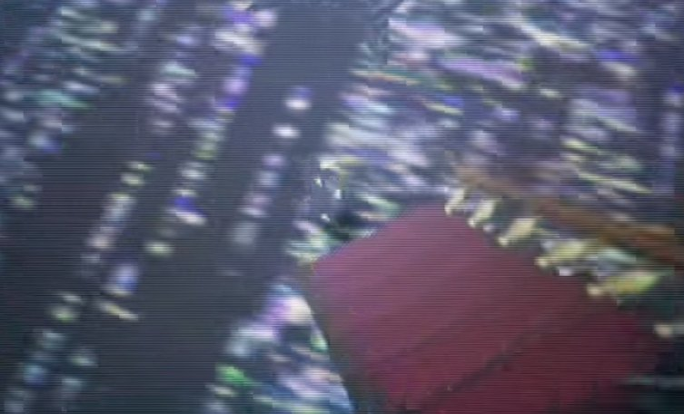{width="400"}

The texture that appears after Mr. Crow falls down the stairs and in Let’s Play Catastrophe Crow! Ep. 1 after encountering Crawler resembles a DNA chart

### Lightning Struck Mr. Crow

As can be seen in the original drawing and in one of the drawings in the children’s room in WHAT HAPPENED TO CROW 64?, Mr. Crow has been struck by lightning, suggesting that the person he represents was struck by lightning in real life. Supporting this is that the brain scan flash looks like a flash of lightning.

### Seizures

Seizures can be compared to a lightning storm, and Mr. Crow falling down the stairs also resembles a seizure. Plus, the brain scan images appear when he tumbles. However, it should be noted that seizures in real life typically aren’t this dramatic, and the seizure imagery is just coincidental.

Tying into the lightning theory, it’s possible Mr. Crow experienced a lightning seizure, a momentary and abrupt loss of consciousness combined with spasms. Lightning seizures also can cause long term brain damage or even death

## Supplemental Material

- [Thematic thoughts on Catastrophe Crow](https://docs.google.com/document/d/1eAxLVEP0xbnmzgTiw56bdEeakB6DZ0T1B0tEWc5JkaU/edit) by ParadoxFactor. A document of various observations and speculations by a researcher here.
- TL;DR version of this documentby BMB (no longer available)
- [Crow 64](https://docs.google.com/document/d/1Ckn8AoXWiINlOeMIT9d6464pX2gOD0_Cd238OtOAWXM/edit) - Nigrendoby Wintyr
- [Decoding CROW 64](https://www.youtube.com/watch?v=6zhwodS0jUU) by Sagan Hawkes. One of the first youtubers to cover Catastrophe Crow and a good summary of the ARG, published October 30th 2020.
- [Crow 64 Iceberg | Deep Dive into Crow 64 Research Document](https://www.youtube.com/watch?v=0aoZELGLNDU).By Sagan Hawkes.
- [I Was Messaged A Game That Doesn't Exist](https://www.youtube.com/watch?v=XYZolVGULg8) - Inside A Mindby Inside a Mind
- [Crow 64: The Lost Nintendo Game ARG](https://www.youtube.com/watch?v=Nf31hhUwbPI) by Night Mind
- [What is Catastrophe Crow?](https://www.youtube.com/watch?v=HlmYUtJ732s) by Ethan Christensen
- [Crow 64 all frames](https://mega.nz/folder/9p8yzYiD#vY-ewwQ1xqEE73zrbsmPYg) by kingofroses
- [Crow 64: German Folklore](https://docs.google.com/document/d/14wwtb1tiNnYnn9kJ3FBCYMEdhEayEwcYqFLXWVoYn-w/edit) by Jinlong the Golden Dragon
- [Static Document](https://misaelk.github.io/crow64-doc/) by MisaelK
- [Game Theory: Beware Crow 64 c̸̛̊rO̵̼̮͐̄́̀͘W̴̘̪͈̆ 6̵̓͛͒4̴̈͗̃̋ c̶̾́́̀̑Ȑ̸̲̪̅͘O̶w̵̄̀̆̅̕͝ 6̴̞̓̒̈́̇4̶̩̘͗͌̉](https://www.youtube.com/watch?v=wvZtYgIIe2E)by Game Theory
